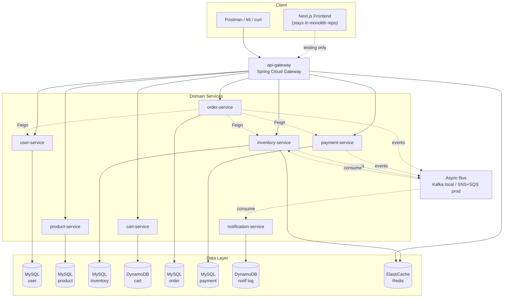

# Lesson 01 — Bounded Contexts and Service Boundaries

> **Goal**: 點解要拆 microservices？拆嘅時候 boundary 點劃？拆完之後 distributed system 嘅遊戲規則點變？
>
> **Deliverable**: 呢份 markdown + service-boundary diagram + 對 OnlineShopping 8 個 service 嘅 ownership 清晰 mental model
>
> **Hands-on weight**: 輕（無 code change）。重點係 alignment 同 mental shift

---

## Learning Objectives

完成呢個 lesson 之後你應該識：

1. 講得出 5 個 monolith → microservices 嘅 motivation（Conway's Law 為首）
2. 講得出 microservices **新出現**嘅 5 個 problem（distributed transaction 為首）
3. 背得出 8 fallacies of distributed computing
4. 解釋 CAP theorem 同點解 P 唔係 optional
5. 識 CAP 係 **per-operation** 而唔係 per-service
6. 用 DDD bounded context 劃 OnlineShopping 嘅 8 個 service
7. Spot「shared domain model」呢個反 pattern

---

## 1. Why Microservices?

### Monolith 嘅 5 大痛

| Pain | Monolith 表現 | 影響 |
|------|---------------|------|
| **Deploy 風險大** | 改一行 → 重 build 成個 app → deploy 全 app | 改 user 邏輯都可能炒咗 product endpoint |
| **Scale 一齊嚟** | 黑五 product browsing 爆 → 連 admin / auth 都一齊 scale | 浪費 cost，DB connection pool 打交 |
| **Tech stack 鎖死** | 全 app 一個 Java version、一個 Spring version | Upgrade 牽連太廣，唔敢動 |
| **Failure blast radius 大** | Search OOM → 全 app crash → login / cart 一齊 down | Outage 而非 degradation |
| **新人 onboarding 慢** | 第一日要讀 50 萬行 code | Productivity 低，team scaling 困難 |

### Microservices 5 大著數

#### (1) Conway's Law Alignment
> "Organizations design systems that mirror their communication structure." — Melvin Conway, 1967

如果公司有 8 個 product team，monolith 強迫 8 team 編 1 個 codebase → 永恆 merge conflict + release 排隊。Microservices 嘅 service 邊界應該 = team 邊界 = 每 team 自治。

#### (2) Independent Deployment
User-service 改 password reset 邏輯，重 deploy 只 affect user-service。其他 7 個 service 完全唔知。

#### (3) Independent Scaling
- Black Friday: product-service 跑 50 instances，auth 仲係 5 instances
- Cost-efficient，按真實 load profile 配 resource

#### (4) Tech Stack Flexibility
- Notification-service 用 Node.js（async I/O 強）
- Payment-service 用 Java 21（型別安全 + ecosystem）
- 唔需要全 stack 一齊升級

#### (5) Failure Isolation
- Search OOM → 只係 search 不可用，其他 service 用 fallback / cache 繼續運作
- 用戶: "搜唔到，但 cart / browse / checkout 仲 work" >> 全 app 死

---

## 2. BUT — Microservices 唔係免費午餐

### 5 個新出現嘅 problem

#### (1) Cross-service join: 由 SQL JOIN 變 API call / event

**Before (monolith):**
```sql
SELECT o.id, o.total, u.name
FROM orders o JOIN users u ON o.user_id = u.id
WHERE u.id = 123;
```
一個 query 完事。

**After (microservices)**: 三種解法（trade-off 各有不同）：

| 方案 | 點解 | 缺點 |
|------|------|------|
| **API composition** | order-service 攞 order，再 call user-service 攞 name | N+1 problem (100 orders → 100 calls)；要靠 batch endpoint + cache |
| **Data denormalization** | order table 直接存 customer_name_snapshot | 改名要 emit event；snapshot 喺 order context 通常係 desired（紙本歷史）|
| **CQRS / Materialized View** | 讀邊另起一個 read DB，pre-join 好 | 增加 infra；事件流要設計 |

#### (2) Distributed Transactions: ACID 死，迎接 Eventual Consistency

Monolith：
```java
@Transactional
public void createOrder() {
    inventory.decrement();
    payment.charge();
    orderRepo.save();
    // 任何一步失敗 → 全部 rollback，ACID 包住
}
```

Microservices：跨 service 冇 `@Transactional`！要用：
- **2PC**（淘汰）
- **Saga - Choreography**（主流，L13 親手寫）
- **Saga - Orchestration**

> Mental shift: 接受 eventual consistency，唔再追 ACID。

#### (3) Network failures
唔再係 method call。每個跨 service call 都可能 timeout / network partition。

#### (4) Debug 變難
一個 user 嘅 order flow 可能跨 5 個 service。冇 distributed tracing 你唔知邊度死。L15 教 OpenTelemetry。

#### (5) Deployment / Operational complexity
8 個 service 各自 deploy / monitor / log。需要 IaC + CI/CD + observability stack。

---

## 3. 8 Fallacies of Distributed Computing

> Peter Deutsch (Sun Microsystems, 1994). 新人寫 distributed system 必踩。

| # | Fallacy | 真相 |
|---|---------|------|
| 1 | The network is reliable | Network 會斷、丟 packet、reorder |
| 2 | Latency is zero | 跨 service call 50-200ms 起跳，跨 region 更慘 |
| 3 | Bandwidth is infinite | 大 payload (MB-level JSON) 會塞網 |
| 4 | The network is secure | MITM、token replay、DNS hijack |
| 5 | Topology doesn't change | K8s pod 隨時 restart，IP 變動 |
| 6 | There is one administrator | 多 team 各自管理，permission / config drift |
| 7 | Transport cost is zero | 跨 AZ / cross-region data egress 收費 |
| 8 | The network is homogeneous | 不同 service 不同 protocol / version / framework |

> **Interview tip**: 問 "what's the hardest part of microservices?" 引用 Peter Deutsch 即時 +1 印象。

---

## 4. CAP Theorem

> Eric Brewer, 2000. 分散式系統最多揀 2 個。

```
        Consistency (C)
              /\
             /  \
            / CA \
           /------\
          / CP  AP \
         /----------\
        /            \
   Partition     Availability
   Tolerance        (A)
   (P)
```

- **C (Consistency)**: 全 node 睇到同一份 data
- **A (Availability)**: 每個 request 必有回應
- **P (Partition tolerance)**: Network 斷（partition）兩邊都繼續做

### 真實世界係 C / A 二揀一

P 唔係 optional — network 一定會斷，你冇得唔 tolerate。所以實際係 CP 或 AP：

|  | CP 系統 | AP 系統 |
|--|---------|---------|
| 寧可 | reject 都唔好錯 | stale 都要 always-on |
| 例子 | MySQL master-slave、Zookeeper | DynamoDB、Cassandra |
| 場景 | 銀行轉帳、Order、Payment | Cart、Browse、Notification |

### Critical Insight: CAP 係 per-operation，唔係 per-service

同一個 service 唔同 operation 可以行不同 CAP profile。最經典係 **inventory**：

| Operation | CAP | Why |
|-----------|-----|-----|
| Read「showing 5 left」喺 product page | AP | Stale 30 秒無人察覺 |
| Decrement「真係扣 1 件 stock」 | **CP** | Black Friday 1000 客同時搶最後 1 件 — AP 會 oversell |

> **點解 oversell 咁災難？** 想像 1000 客同時撳「Buy」最後 1 件 stock — AP 系統可能畀全部 1000 個 `200 OK`，跟住 999 個客等貨等到 timeout / 收到「對唔住，無貨退錢」嘅 email。賠返錢易，但賠商譽 + 客服 burden + 法律風險就麻煩。Solution: optimistic locking (`@Version`) — **Lesson 6** 會親手 demo race condition + fix。

### 我地 8 個 service 嘅 CAP profile

| Service | CAP | Notes |
|---------|-----|-------|
| user-service | CP（auth）+ AP（profile read） | Login 必須一致；profile cache 可 stale |
| product-service | AP | Read-heavy、price update 30s propagate 接受 |
| inventory-service | **CP（decrement）+ AP（read）** | 核心：per-operation！|
| cart-service | AP | Per-user，stale 1s 可接受 |
| order-service | CP | Order state 必須一致 |
| payment-service | CP | 錢銀，零妥協 |
| notification-service | AP | Email 遲 1min 唔死人 |
| api-gateway | (stateless) | 無 state，無 CAP issue |

---

## 5. DDD Bounded Context — 點劃線

> Eric Evans, *Domain-Driven Design* (2003)
>
> **Core principle**: 同一個字喺唔同 context 入面，意思唔同。每個 context 自己擁有自己嘅 model。

### 例：「Product」喺 OnlineShopping 5 個 service 入面有 5 種意思

| Service | "Product" 嘅意思 | 字段 |
|---------|------------------|------|
| product-service | 商品 full detail | id, name, description, price, category, images, status |
| inventory-service | 一個 SKU 嘅庫存 | sku, stock_count, reserved_count, version |
| cart-service | Cart 入面一行 | product_id, quantity, added_at |
| order-service | 落單時 snapshot | product_id, **name_at_purchase**, **price_at_purchase** |
| payment-service | 唔關事 | （只關心 amount） |

### Anti-pattern: Shared Domain Model

**唔好** 整一個 `common-domain` jar 入面有 `Product.java`，比 8 個 service 一齊用。為何：
- 一個 service 改 Product schema → 全 8 service 要重 deploy
- 等於拆極都係 distributed monolith
- 違反 microservices 自治原則

**正路**：每個 service 自己 lightweight `Product` model + 用 event / API 同步必要 field。

> 唯一可以 share 嘅 jar：
> - `common-events`（event POJO，cross-service 通用）
> - `common-dto`（lightweight response DTO，read-only）
>
> **唔可以** share：entity / aggregate / business logic / repository。

---

## 6. OnlineShopping 8 Services Mapping

### Service Ownership Table

| Service | Entities Owned | Public Endpoints | DB | CAP Profile | Source from Monolith |
|---------|----------------|------------------|----|-----|---------|
| **api-gateway** | (none) | proxy + JWT filter + rate limit | Redis (rate limit) | stateless | (new) |
| **user-service** | User, Role | `/auth/*`, `/users/*` | MySQL | CP (auth) / AP (profile read) | `User.java`, `AuthController`, `JwtService` |
| **product-service** | Product, Category | `/products/*`, `/categories/*` | MySQL | AP | `Product.java`, `Category.java`, `ProductController` |
| **inventory-service** | StockItem | `/inventory/{sku}`, `/inventory/reserve` | MySQL + Redis | **CP (decrement) / AP (read)** | (new — monolith stock 散喺 ProductService) |
| **cart-service** | CartItem | `/cart/*` | DynamoDB | AP | `CartItem.java`, `CartController` (schema 改) |
| **order-service** | Order, OrderItem, SagaExecution, SagaStepLog | `/orders/*` | MySQL | CP | `Order.java`, `OrderItem.java`, Saga entity, `OrderController` |
| **payment-service** | Payment | `/payments/*` | MySQL | CP | `Payment.java`, `PaymentController` |
| **notification-service** | NotificationLog | (consumer only) | DynamoDB | AP | (new) |

### Architecture Diagram



### Communication Style

| Communication | Style | When |
|---------------|-------|------|
| Gateway → Service | Sync HTTP | All public requests |
| Order → Inventory (reserve) | Sync HTTP (Feign) | Need immediate confirmation |
| Order → Payment (charge) | Sync HTTP (Feign) | Need immediate confirmation |
| Order → Notification | **Async event** | Notification fail 唔可以阻 order 成功 |
| Inventory → Order (release on cancel) | **Async event** | Saga compensation |

---

## 7. Anti-patterns to Avoid

| 反 pattern | 點解錯 | 正路 |
|------------|--------|------|
| **Shared database** | 兩個 service 共用一個 DB → schema change 牽連雙方 | DB-per-service |
| **Shared domain model** | 改一個 entity 全 service 重 deploy | Lightweight model per service + common events |
| **Distributed monolith** | 拆咗形但無拆責任 — 改一處要 deploy 5 個 service | Bounded context 真係要 isolate |
| **Synchronous chain too long** | A → B → C → D → E sync — 任何一段死全死；latency 累加 | 改 async event 或縮 chain |
| **Sync everywhere** | 連 notification 都 sync 等 → 阻 critical path | Fire-and-forget event for non-critical |

---

## 8. Interview Prep / Resume Points

### 5 條典型 interview question 同答法

**Q1: When NOT to use microservices?**
- 細 team (< 10 人)、產品仲喺 prototype 階段、無 DevOps capability
- Monolith first，揾到清晰 bounded context 先拆 (Strangler Fig pattern)

**Q2: How to handle distributed transactions?**
- ACID 死，用 Saga (choreography 或 orchestration)
- Compensation event 處理 rollback
- Idempotency key 處理 retry

**Q3: Explain CAP theorem with a real example.**
- C/A/P 二揀一（P 必有）
- 例：Inventory decrement = CP（防 oversell），Cart = AP（用戶體驗 first）
- CAP 係 per operation，唔係 per service

**Q4: How do you decide service boundaries?**
- DDD bounded context — 揾出每個 aggregate 嘅 ownership
- Conway's Law alignment with team structure
- 避免 shared database / shared domain model

**Q5: What are the 8 fallacies of distributed computing?**
- 答得出 4-5 條已 above-bar，加 Peter Deutsch attribution

### Resume Bullet Draft（complete after L25）

> "Designed and migrated a monolithic e-commerce backend (Spring Boot 3 / Java 21) into 8 microservices using DDD bounded contexts and the Strangler Fig pattern."

---

## 9. Homework / Reflection

> 自己諗完先 expand 答案。

### 1. 你 monolith `Order.java` 入面有冇 reference 到 `User` / `Product` entity？拆咗之後點處理？

<details>
<summary>📝 Solution</summary>

Monolith 真實情況：`Order` 有 `@ManyToOne User user;` + `@OneToMany List<OrderItem> items;`，`OrderItem` 有 `@ManyToOne Product product;` — 全部係 cross-service references。

**Microservices 處理**：唔再用 JPA relationship，改成 plain ID column + snapshot：

| Monolith | Microservices |
|----------|---------------|
| `@ManyToOne User user;` | `private Long userId;` |
| `OrderItem.product → Product` | `OrderItem` 自己存 `productId` + `productNameSnapshot`, `priceSnapshot`, `imageUrlSnapshot` |

**點解 OrderItem 要 snapshot 而唔係 live join？**
- 用戶查歷史 order 想睇**買嘅嗰一刻嘅樣** — product 改名 / 改價之後，舊 order 唔應該變
- 法律 / 會計上，receipt 必須係 immutable historical record
- Snapshot = denormalization on purpose（by design，唔係 anti-pattern）

**需要 user 詳情點處理？**（admin 想睇 order 對應 user email）
- API composition：order-service controller call user-service Feign client 拎 `User` → enrich response
- 唔好喺 DB level 跨 service join

**Black Friday 高 QPS 用 API composition 會 N+1，點解？**
- 100 orders → 100 個 user lookup call = 浪費
- Solution: user-service 暴露 batch endpoint `POST /users/_bulk { ids: [...] }` 一次拎 100 個
- 或者 Redis cache hot user，TTL 1 分鐘
- → L10 (OpenFeign) + L24 (caching) 親手寫

**Mindset 改變**：唔係「好煩」，係由「default join」變「default denormalize + 必要先 enrich」。

</details>

---

### 2. 「Cart 用 DynamoDB」呢個決定，CAP 角度同 access pattern 角度點 justify？

<details>
<summary>📝 Solution</summary>

Interview 想聽 4-5 條完整 justification：

| 角度 | 答法 |
|------|------|
| **CAP** | Cart **per-user**（單一寫者：用戶自己），AP 完全足夠 — 1-2 秒 stale 都唔會察覺；MySQL 嘅 CP 對 cart 來講 overkill |
| **Access pattern** | 100% 單 partition key (`USER#<userId>`) lookup — 永遠 O(1)，無需 join；KV store 設計嘅 sweet spot |
| **Scale** | 1M users 嘅 cart_item table 喺 MySQL 入面 connection pool / query plan / index 都係挑戰；DynamoDB 自動 sharding by partition key，水平擴展冇上限 |
| **Built-in features** | DynamoDB **TTL attribute** — 30 日無動 cart 自動 purge，零 cron job；MySQL 要寫 cleanup script |
| **Cost model** | On-demand pricing 對 bursty load（Black Friday browse spike）特別 friendly，唔使 over-provision |

**反 case**：Order 點解唔用 DynamoDB？
- Order 涉及金額 + 跨 service 一致性 + financial audit → CP 必須
- Order 有 cross-user query（admin 睇所有 today's order）→ 需要 secondary index / range query → MySQL 強得多

→ **Polyglot persistence**：每個 service 揀啱嘅 store，唔係一刀切。Resume 寫得出「polyglot persistence」係 +1 keyword。

</details>

---

### 3. 你公司面試時被問 "what's hardest about microservices"，你會答邊 3 點？

<details>
<summary>📝 Solution</summary>

```
1. Distributed transactions — 跨 service 冇 ACID @Transactional，要 saga + compensation
   + idempotency。最易出 bug、最難 debug 嘅 category。

2. Operational complexity — 8 個 service 各自 deploy / monitor / log。冇 distributed
   tracing（OpenTelemetry）你根本唔知 latency / error 喺邊一段。冇 IaC + CI/CD 直接
   靠人手 = 災難。

3. Data consistency model shift — 由 ACID 強一致過去 eventual consistency。前端要
   handle "我 add cart 完之後 1 秒 refresh 仲未見到" 嘅 UX。Backend 要識用 outbox
   pattern + idempotency key 防 retry 寫雙重。
```

**加分位**（如果 interviewer 想再深）：
- 引用 Peter Deutsch 8 fallacies 之一（network is reliable / latency is zero）
- 提 distributed monolith 嘅 anti-pattern（拆形不拆責任）

</details>

---

### 4. 「shared domain model」反 pattern 你而家 monolith 有冇類似情況？

<details>
<summary>📝 Solution</summary>

關鍵 insight：**單機情況下根本「冇」shared library trap，因為一切都係同一個 package** —
sharing 就係架構本身。

| | Monolith | Microservices |
|---|----------|---------------|
| Architecture | 1 jar, 1 deployment | N jars, N deployments |
| Sharing User class | ✅ **就係架構** — 改完一齊 redeploy 1 個 app | ❌ **trap** — 改完要 redeploy N 個 service = lose 拆 microservices 嘅意義 |
| Bounded context | 隱式 / 可被違反但 compiler 唔阻止 | 顯式（physical boundary）|

**Mental model**：
- Monolith：sharing 係**默認假設** — 你寫 `import com.shop.User` 唔需要諗
- Microservices：sharing 係**特權** — 每次跨 service share 都要問「呢個係 schema (✅) 定 implementation (❌)？」

**監察 monolith 入面有冇即將會變成 trap 嘅嘢**：
- `BaseService` / `BaseEntity` / `BaseRepository` — 喺 monolith OK，**永遠唔可以**搬入 cross-service shared module
- 你拆 service 時，每個 service 自己 copy 一份（DRY 嘅例外 — bounded context > DRY）

**呢個解釋咗 L2 嘅 deliverable design**：
- `common-events` ✅ — schema (event POJO contract)
- `common-dto` ✅ — schema (response envelope structure)
- 永遠**唔起** `common-domain` 入面放 `User` `Order` `Product` entity — 即係搬 monolith 嘅 sharing 假設過嚟微服務世界，係 distributed monolith 嘅起點

</details>

---

## 10. 下一步 — Lesson 02 預告

**L2: Multi-Module Maven + Shared Library Trap**

- 設定 parent POM + 3 個 service module
- 設定 `shared/common-events` + `shared/common-dto`
- 反面教材：分析「乜嘢時候 share 係 OK，乜嘢時候係伏」
- Java 21 + Spring Boot 3.5.x baseline
- 開 branch `lesson-02-multi-module`

---

## References

- Eric Evans, *Domain-Driven Design* (2003)
- Sam Newman, *Building Microservices* (2nd ed., 2021)
- Peter Deutsch, *8 Fallacies of Distributed Computing* (1994)
- Eric Brewer, *CAP Theorem* (2000)
- Martin Fowler, *StranglerFigApplication* (martinfowler.com/bliki/StranglerFigApplication.html)
