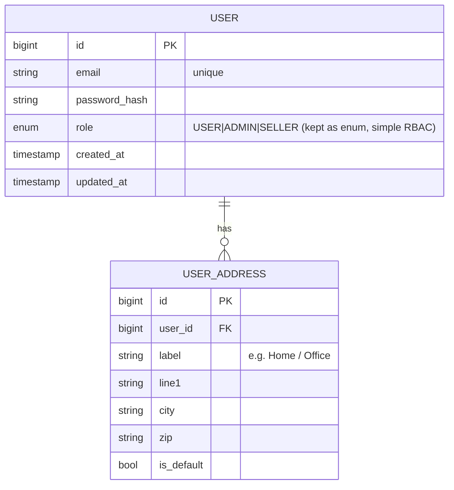
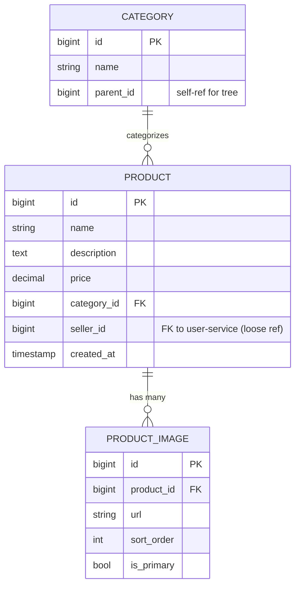
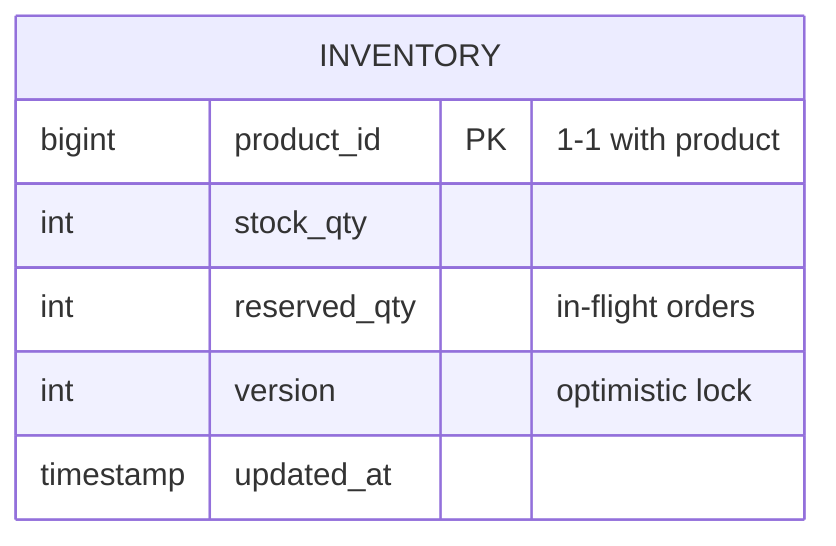
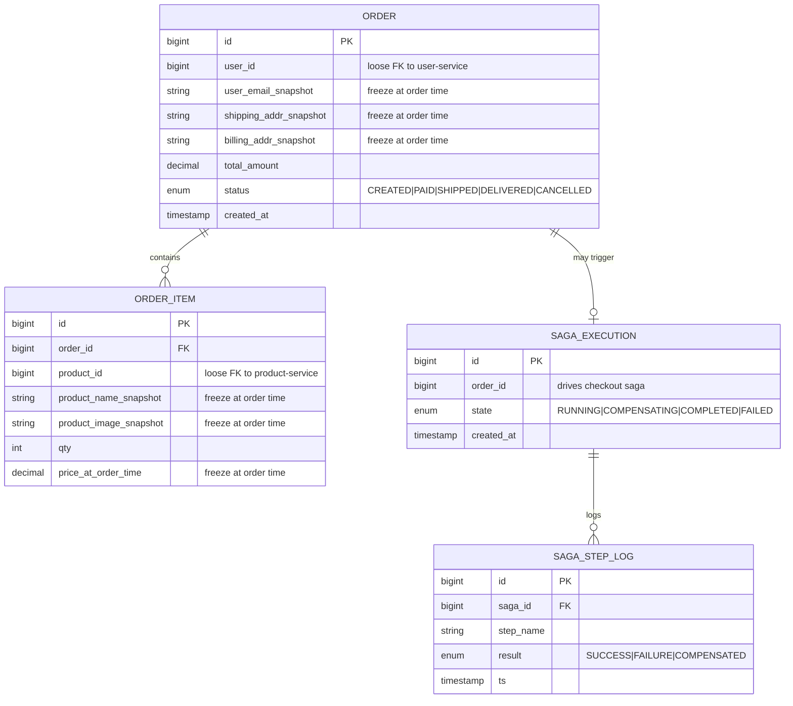
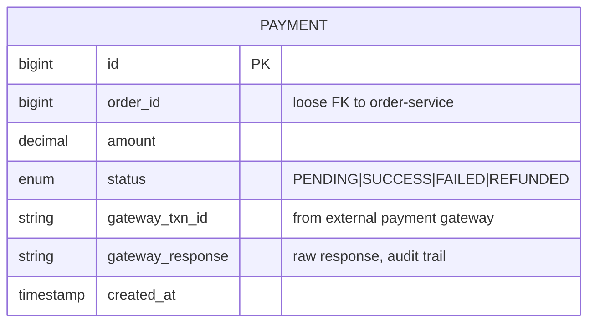
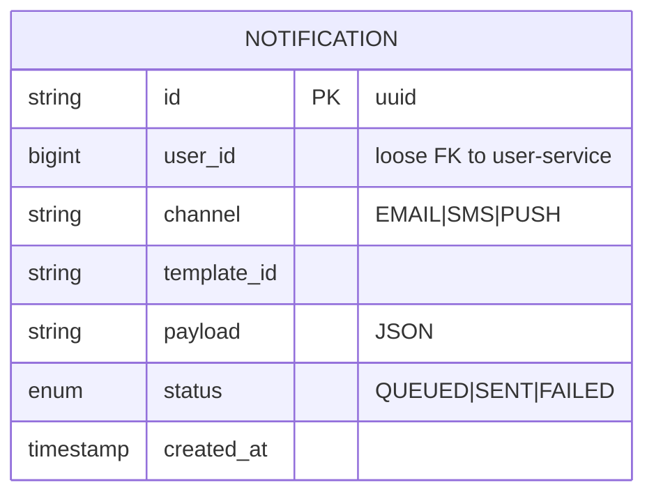

# Lesson 03 — Database Decomposition: From Single Schema to DB-per-Service

> **Goal**: 由 monolith single schema 切出 7 個 service 各自 own 嘅 table；學識 cross-service query 嘅 3 大 pattern；Cart redesign 由 SQL → DynamoDB；認識 production migration 嘅 Strangler Fig + 3-phase cutover。
>
> **本 lesson 全 design + ER + schema doc，唔寫 service code**。Code 喺 L4 開始實際抽 user-service 嗰陣寫，並 apply 本 lesson 教嘅 outbox pattern。

---

## Learning Objectives

完成本 lesson 後，你應該答得出：

1. 點解微服務要 **DB-per-service**？單一 MySQL server + 多 schema 隔開可唔可以？技術上 work 但會死喺邊？
2. **4 條 heuristic** 判斷某張 table 應屬邊個 service
3. **3 大 cross-service query pattern** (API composition / Denormalization / CQRS) 嘅 trade-off + 各自最適合嘅場景
4. 點解 **Cart 適合 DynamoDB 但 Order 唔適合** — access pattern 角度
5. **DynamoDB single-table design** 嘅 PK/SK 結構 + access pattern → operation mapping
6. Production migration 嘅 **Strangler Fig 3-phase + outbox pattern** + 點解 dual-write 唔 atomic 嘅問題

---

## 1. Why DB-per-Service (Not Just Multiple Schemas)

**Naive 問題**：「點解唔可以全部 service 共用一個 MySQL server，但每個 service 用唔同 schema/database name 隔開就算？」

技術上**做得到**。但會死喺以下 6 條 axis：

| Axis | 災難 |
|------|------|
| **Availability blast radius** | One MySQL server down → 全部 service 一齊死。HA 範圍同 monolith 一樣。 |
| **Resource contention** | Order service 跑一個 heavy report query lock 住 CPU → user login 跟住變慢（noisy neighbor） |
| **Scaling independence** | Cart 高 write 想升 r6i.4xlarge，但 user 低 write 用唔著咁強 — 共用 server 冇得 size per workload |
| **Schema independence** | 同一 server 入面，dev 一寫得出 `SELECT * FROM order JOIN user.user ON ...` 就破晒 boundary（cross-schema query 技術上 work）→ 隱形 coupling |
| **Team ownership (Conway's law)** | User team 想 alter schema 要通知所有人 + DBA approval → 獨立 evolve 變唔可能 |
| **Storage swap** | Cart 想 migrate 去 DynamoDB，但 share server 你郁唔到 DB-level 嘅嘢 |

**最 deadly 嗰條係 Schema independence**：純技術隔離（separate schema）唔阻止得到開發者寫 cross-schema join。獨立 DB instance 之所以 work，係因為**物理上做唔到 join**，所以強制大家用 API call / event 通信。**Constraint as feature.**

> **面試 punch line**：「DB-per-service 嘅核心唔係性能或者 scaling — 係 *enforced boundary*。Same server + multiple schema 係 voluntary boundary，總有一日會被一個趕 deadline 嘅 dev 用 cross-schema JOIN 破掉。Physical separation 係令 boundary violation **物理上做唔到**。」

---

## 2. The 4 Heuristics for Service Ownership

每張 table 諗清楚就唔會錯太遠：

| # | Heuristic | 問法 |
|---|-----------|------|
| 1 | **Lifecycle** | 呢兩張 table 係咪一齊 born、一齊 die？(e.g. `product` + `product_image` 都係 seller upload product 嗰陣一齊 create) |
| 2 | **Transactional consistency** | 呢兩張 table 嘅 update 需唔需要 ACID 一齊 commit？(e.g. `order` + `order_item` 必須 atomic — 唔可以有 order 但冇 line item) |
| 3 | **Read affinity** | 邊個 use case 最常一齊 read 呢兩張 table？(e.g. checkout flow 永遠一齊 read `order` + `order_item`) |
| 4 | **Team ownership / change cadence** | 邊個 team 改呢張 table？兩張 table 嘅改動週期一致嗎？(e.g. `product` schema stable，`inventory` 數字日日狂 update — 唔同 team owner) |

**4 條全部點頭 → 同一 service。任何一條搖頭 → 應該分 service。**

> **Bounded context 嘅劃法冇科學公式，但有 4 條 heuristic — lifecycle、transactional consistency、read affinity、team ownership。每張 table 對住呢 4 條問，至少答到自己點解放呢度。錯咗都唔死人 — microservices boundary 係 reversible，最忌怕錯就唔郁，結果 boundary 慢慢爛。**

---

## 3. ER Mapping per Service (Hands-on Deliverable)

由 monolith 14-15 張 table 切去 7 個 service，逐個 service ER 如下：

### 3.1 user-service



**Notes**：
- `role` 保留 enum column，唔開 `user_role` join table — simple RBAC 夠用
- `user_address` 係**用戶嘅 saved address book**（可變）。Order 用嘅 shipping snapshot 係另一份，喺 order-service

### 3.2 product-service



**Notes**：
- `seller_id` 係 cross-service reference（loose FK，no DB constraint）— 指向 user-service 嘅 user.id
- `category` 同 `product` lifecycle / read affinity / team 都緊密 → 留 product-service

### 3.3 inventory-service



**Notes**：
- 由 monolith 嘅 `product.stock_qty` column 抽出嚟做獨立 table + 獨立 service
- 點解？因為 stock 嘅 update cadence 同 product metadata 完全唔同 — heuristic #4 (change cadence) 搖頭
- L6 會深入 race condition + optimistic locking + Redis cache

### 3.4 cart-service (DynamoDB — see Section 5)

唔係 SQL — 詳細 schema 喺 Section 5。

### 3.5 order-service



**Notes — `_snapshot` columns 係本 lesson 最重要嘅 design pattern**：
- 用戶 1 月 1 日下 order，product `iPhone 15` 賣 $999
- 3 月 1 日 product 改名做 `iPhone 15 (refurb)`，加價變 $1099
- 1 月嗰張 order 嘅 receipt **必須仲記住** `iPhone 15` + `$999`
- 要做到呢個 business correctness，order_item 一定要 snapshot product info 喺 creation time
- Snapshot **唔係冗餘**，係 **first-class data** — 因為 source of truth 係「下單嗰刻嘅事實」

`saga_execution` + `saga_step_logs` 歸 order-service 因為 e-commerce 主 saga 係 checkout，order-service 做 orchestrator。L8 深入 saga pattern。

### 3.6 payment-service



**Notes**：
- ACID 要求高 — 錢嘅嘢，MySQL 唔走數
- `gateway_response` 整個原始 response 收住，俾將來 audit / dispute 用

### 3.7 notification-service



**Notes**：
- 高 write、append-only、查詢只 by user_id + time range → 適合放 DynamoDB（同 cart 一樣）
- 課程簡化：MVP 階段用 MySQL，L20 之後再 swap 去 DynamoDB

---

## 4. Cross-Service Query — 3 Patterns

Single schema 入面 `JOIN` 一行 SQL 搞掂；split 之後，cross-service query 變成 cross-network call。

### 4.1 Use Case: `GET /api/orders/123`

預期 response shape：

```json
{
  "orderId": 123,
  "userEmail": "alice@example.com",
  "items": [
    {
      "productName": "iPhone 15",
      "productImage": "https://.../1.jpg",
      "qty": 2,
      "priceAtOrderTime": 999.00
    }
  ],
  "totalAmount": 1998.00,
  "shippingAddress": "Tsim Sha Tsui, ..."
}
```

**Monolith baseline (1 SQL JOIN)**：

```sql
SELECT o.id, u.email, p.name, p.image_url, oi.qty, oi.price_at_order,
       o.total, o.shipping_address
FROM `order` o
JOIN user u         ON u.id = o.user_id
JOIN order_item oi  ON oi.order_id = o.id
JOIN product p      ON p.id = oi.product_id
WHERE o.id = 123;
```

但 split 之後 `user`, `product`, `order` 各有自己嘅 DB，呢條 JOIN 唔再做得到。三條解法：

### 4.2 Pattern 1 — API Composition (Synchronous Orchestration)

```java
public OrderDetailDto getOrder(Long id) {
    Order order = orderRepo.findById(id);                     // 1. 自己 DB
    User user   = userClient.getUser(order.getUserId());      // 2. HTTP → user-service

    List<Long> productIds = order.getItems().stream()
        .map(OrderItem::getProductId).toList();
    List<Product> products =
        productClient.getProducts(productIds);                // 3. HTTP → product-service (BATCH!)

    return OrderDetailDto.assemble(order, user, products);
}
```

| 角度 | 講法 |
|------|------|
| 👍 | 實作簡單，data 永遠 fresh |
| 👎 Latency | Sequential calls 累加 — 一個 call 變 N 個 hop |
| 👎 N+1 problem | Naive `for item: getProduct(id)` 變 N 個 HTTP — 必須 batch endpoint |
| 👎 Cascading failure | user-service 死 → order detail 跟住 500 — 需 Resilience4j circuit breaker |
| 👎 Coupling | order-service 知道太多其他 service detail |

**幾時用？** 需要 fresh data（account balance, real-time inventory），cross-service hop 少。

### 4.3 Pattern 2 — Denormalization (Snapshot at Write Time) ⭐

Order 創建嗰刻 copy user email、product name、product image 入 order/order_item 自己嘅表，永久保存。Read 時零 cross-service call。

**Write path**：

```java
@Transactional
public Order createOrder(CreateOrderCmd cmd) {
    User user = userClient.getUser(cmd.getUserId());          // 1 次 HTTP
    List<Product> products =
        productClient.getProducts(cmd.getProductIds());       // 1 次 HTTP (batch)

    Order order = new Order();
    order.setUserEmailSnapshot(user.getEmail());              // ✨ snapshot
    order.setShippingAddrSnapshot(cmd.getShippingAddress());

    for (ItemCmd item : cmd.getItems()) {
        Product p = findProduct(products, item.getProductId());
        OrderItem oi = new OrderItem();
        oi.setProductNameSnapshot(p.getName());               // ✨ snapshot
        oi.setProductImageSnapshot(p.getImageUrl());          // ✨ snapshot
        oi.setPriceAtOrderTime(p.getPrice());                 // ✨ snapshot
        order.addItem(oi);
    }
    return orderRepo.save(order);
}
```

**Read path**：

```java
public OrderDetailDto getOrder(Long id) {
    return orderRepo.findById(id);   // ← 一條 SQL，零 cross-service call
}
```

| 角度 | 講法 |
|------|------|
| 👍 Read 超快 | 一條 SQL 完事，response 由 120ms → 20ms |
| 👍 No runtime dep | user-service / product-service 死，order detail 仲 work |
| 👍 **Business correct** | Receipt 永遠 freeze 喺 creation time。Product 改名/改價對舊 order 無影響 |
| 👎 Storage redundancy | Same product name 可能存喺百萬 order_item — 但 storage 平 |
| 👎 Stale risk if misused | 如果用 snapshot 去 serve 需要 fresh 嘅嘢就出事 |

**幾時用？** Order / invoice / payment / shipment / audit log — 任何「過咗 = freeze」嘅 financial / legal record。**呢個係 80% e-commerce 嘅 default 答案。**

### 4.4 Pattern 3 — CQRS / Materialized View

開獨立 `order-query-service`，subscribe `OrderCreated` / `UserUpdated` / `ProductUpdated` events，將數據 denormalize 入自己嘅 read store（e.g. Elasticsearch）。Write / read 完全分家。

```
order-service ──OrderCreated──▶┐
user-service  ──UserUpdated───▶├─▶ order-query-service ──▶ ES doc
product-svc   ──ProductUpdated▶┘                         (denormalized)
```

| 角度 | 講法 |
|------|------|
| 👍 | 任何複雜 query (search/filter/aggregate) 一個 lookup 完事 |
| 👍 | Write/read 完全 decouple，scale 獨立 |
| 👎 | Eventual consistency (event lag) |
| 👎 | 多套 stack 養 (Elasticsearch + event subscription + reconciliation) |

**幾時用？** Search / filter / admin dashboard / reporting。Read 量遠超 write (10x+)。**Course 入面 L20 左右掂，L3 識講就夠。**

### 4.5 Decision Tree

```
Need fresh data (real-time)?
├─ Yes → Pattern 1 (API Composition)
└─ No (snapshot acceptable / preferred)
       ├─ Search / filter / aggregation?
       │    └─ Yes → Pattern 3 (CQRS)
       └─ Simple per-entity read?
            └─ Yes → Pattern 2 (Denormalization) ⭐ default
```

### 4.6 Apply to Mapping

| Cross-service tension | Pattern | 理由 |
|-----------------------|---------|------|
| `order_item` 要 product name/image/price | **Pattern 2 snapshot** | Order freeze；商品改價對舊 order 無影響 |
| `order` 要 user email | **Pattern 2 snapshot** | Receipt freeze |
| `cart_item` 要 product name/image/price | **Pattern 1 fresh API call** | Cart 要 fresh price（商家加價要見到）|
| `order` decrement `inventory` | Cross-service WRITE → **Saga + Outbox** | L8 教 |
| Admin: 「過去 30 日某 product 嘅 sales」 | **Pattern 3 CQRS** | Aggregation query, cross-service data |
| `payment` ↔ `order` | Pattern 2 snapshot order_id + amount | 簡單 reference + amount frozen |

---

## 5. Cart Redesign — SQL → DynamoDB

### 5.1 Why DynamoDB?

Cart 嘅 access pattern：

| Axis | Cart | Order |
|------|------|-------|
| **主要 query** | 100% by `userId` | 多 dimension (user/date/status/amount) |
| **複雜 query 需要** | 冇 | 要 (admin / finance / inventory reports) |
| **Aggregation** | 冇 | 要 (SUM / GROUP BY) |
| **Multi-row transaction** | 冇 | 要 (Order + OrderItem + Payment atomic) |
| **數據壽命** | 短 (checkout 後丟 / 30 日 TTL) | 長 (financial record) |
| **Write throughput** | 高 (每次 add/remove) | 中等 |
| **ACID 需要** | 弱 | 強 |

→ **Cart = single-key access + 高 write + 短命 → DynamoDB perfect fit**
→ **Order = multi-dimensional query + ACID + aggregation → MySQL stays**

### 5.2 Access Patterns Enumeration

DynamoDB schema 嘅第一原則：**先列 access pattern，再倒推 schema。** 唔係由 entity 開始諗。

| AP # | Operation | Frequency |
|------|-----------|-----------|
| AP1 | `GetCart(userId)` — view cart, navbar badge | 🔥🔥🔥 (every page nav) |
| AP2 | `AddItem(userId, productId, qty)` | 🔥🔥 |
| AP3 | `UpdateItemQty(userId, productId, qty)` | 🔥 |
| AP4 | `RemoveItem(userId, productId)` | 🔥 |
| AP5 | `ClearCart(userId)` — after checkout | low |
| AP6 | `MergeCart(guestSessionId, userId)` — login conversion | low |
| AP7 | `ExpireAbandonedCart` — system, after N days | system |

### 5.3 Single-Table Design

**4 個 design decision**：

1. **Item shape**: One-item-per-cart-line（避免 read-modify-write race condition）
2. **PK**: `USER#{userId}` (all access by user)
3. **SK**: `META` for cart metadata, `ITEM#PROD#{productId}` for cart lines
4. **TTL**: built-in DynamoDB TTL feature, set `ttl = updatedAt + 30 days`

**Schema**：

```
Table: cart
  PK (HASH):  pk    String
  SK (RANGE): sk    String
  TTL field:        ttl Number

──────────────────────────────────────────────────────────────────
Items in partition USER#123:
──────────────────────────────────────────────────────────────────

pk=USER#123  sk=META
  createdAt   = "2026-05-01T10:00:00Z"
  updatedAt   = "2026-05-03T14:32:00Z"
  ttl         = 1748952720         (updated_at + 30d)

pk=USER#123  sk=ITEM#PROD#1
  productId   = 1
  qty         = 2
  addedAt     = "2026-05-01T10:00:00Z"
  priceAtAdd  = 999.00              (snapshot for price-change detection)
  ttl         = 1748952720

pk=USER#123  sk=ITEM#PROD#5
  productId   = 5
  qty         = 1
  addedAt     = "2026-05-03T14:32:00Z"
  priceAtAdd  = 49.99
  ttl         = 1748952720
```

**為何 priceAtAdd snapshot？**

> 用戶 1pm 加 iPhone 落 cart 嗰陣係 $999。3pm 商家加價變 $1099。用戶 5pm 想 checkout — UI 要顯示「⚠️ 價格由 $999 調整為 $1099 — [Update] / [Remove]」。Snapshot 唔係為 freeze price（freeze 係 order_item 責任），係為 detect price change 觸發 user warning。

`productName` / `productImage` 唔 snapshot — 由 product-service API call 拎 fresh (Pattern 1)。

### 5.4 Access Pattern → DynamoDB Operation

| AP | DynamoDB Operation | 備註 |
|----|-------------------|------|
| **AP1 GetCart** | `Query(PK=USER#123)` | 一次返晒 META + items |
| **AP2 AddItem** | `UpdateItem(PK, SK=ITEM#PROD#1)` with `ADD qty :qty` | atomic increment, 唔需 read-modify-write |
| **AP3 UpdateQty** | `UpdateItem(PK, SK)` with `SET qty = :qty` | |
| **AP4 RemoveItem** | `DeleteItem(PK, SK=ITEM#PROD#1)` | |
| **AP5 ClearCart** | `Query(PK) → BatchWriteItem(DELETE)` | DynamoDB 冇 "delete by partition key" |
| **AP6 MergeCart** | `Query(guestId) → BatchWriteItem PUT to userId` | Application-level orchestration |
| **AP7 Expire** | DynamoDB TTL background scan | 你乜都唔使做 ✨ |

✨ **每條 AP 都係 1-2 個 operation 完事 — 呢個就係 access-pattern-driven design 嘅 win。**

### 5.5 SQL vs DynamoDB

| Op | SQL | DynamoDB |
|----|-----|----------|
| GetCart | `SELECT JOIN`, ~20-50ms | `Query`, single-digit ms |
| AddItem | `SELECT WHERE` + `INSERT/UPDATE` (read first) | `UpdateItem ADD` 一行掂 atomic |
| Scale write | RDBMS write throughput 限於 master | Auto-shard 跨 partition, linear scale |
| Cleanup abandoned | Cron `DELETE WHERE updated_at < ...` | TTL free |
| Cross-cart aggregation | `GROUP BY product_id` 任意做 | ❌ 做唔到 — 但呢個係 feature (force CQRS to analytics) |

---

## 6. Migration Strategy — Strangler Fig + 3-Phase Cutover

**Scenario 設定**：100K active user + 50K cart + $50K/day revenue + 唔可以停機。

### 6.1 兩條死路

#### ❌ Big Bang Migration

凌晨 2am maintenance window → dump → restore → repoint → 開機。

**死因**：window 預 2hr 實際 6hr ($12.5K lost revenue) + dump-restore 期間整個 system freeze + restore 出錯凌晨 4am debug + rollback 等於再做一次 migration + Twitter 投訴。

#### ❌ Hard Cut Without Downtime

Deploy new service code，flag 一翻 from now on read/write 全去 new service。

**死因**：100K existing user 全部 read fail（新 DB 空空）+ 30 秒就死。

### 6.2 正解：Strangler Fig 3 Phase

**Strangler Fig** (Martin Fowler) — 名來自絞殺榕：由樹頂慢慢包住宿主樹最終取代。**漸進取代，每一步可逆。**

```
┌────────────────────────────────────────────────────────────┐
│ Phase 1: DUAL-WRITE        (3-7 days)                      │
│   Write: monolith ✓ + new ✓                                │
│   Read:  monolith ✓                                         │
│   Goal:  catch up new DB, validate write path              │
└────────────────────────────────────────────────────────────┘
                            ↓
┌────────────────────────────────────────────────────────────┐
│ Phase 2: SHADOW-READ       (3-14 days)                     │
│   Write: monolith ✓ + new ✓                                │
│   Read:  monolith ✓ (serve) + new ✓ (compare, no serve)    │
│   Goal:  detect data drift, validate read path             │
└────────────────────────────────────────────────────────────┘
                            ↓
┌────────────────────────────────────────────────────────────┐
│ Phase 3: CUTOVER           (gradual ramp)                  │
│   3a. Read switch: 1% → 10% → 50% → 100% from new          │
│   3b. Stop monolith write                                   │
│   3c. Drop monolith table (point of no return)             │
└────────────────────────────────────────────────────────────┘
```

### 6.3 Phase 1 — Dual-Write + Outbox

App-level dual-write 嘅問題：**唔 atomic** — monolith DB commit 成功 → new service call timeout → drift。

**Outbox pattern (production grade)**：

```java
@Transactional
public User updateUser(Long id, UpdateUserCmd cmd) {
    User user = userRepo.save(...);                          // 1. monolith user table
    outboxRepo.save(new OutboxEvent(                         // 2. SAME transaction
        type="UserUpdated",
        payload=user.toJson()
    ));
    return user;
}

// Background poller
@Scheduled(fixedDelay = 1000)
public void publishOutbox() {
    List<OutboxEvent> pending = outboxRepo.findUnpublished(limit=100);
    for (OutboxEvent e : pending) {
        userServiceClient.upsertUser(e.payload);             // 3. async, retryable
        outboxRepo.markPublished(e.id);
    }
}
```

**精髓**：Step 1+2 同一個 monolith DB transaction → atomic（要麼兩個都成功，要麼都 rollback）。Step 3 async + idempotent → 可以無限 retry。**Effectively exactly-once delivery，唔需 distributed transaction。**

**Backfill 歷史 data**：Phase 1 同時做 bulk export → import (idempotent UPSERT by user.id)。

**Rollback @ Phase 1**: 🟢 trivial — turn off feature flag。

### 6.4 Phase 2 — Shadow-Read

```java
public User getUser(Long id) {
    User monolithUser = userRepo.findById(id);               // serve client

    if (featureFlag.isEnabled("shadow_read_user")) {
        executor.submit(() -> {                              // async, sampled
            try {
                User newServiceUser = userServiceClient.getUser(id);
                if (!equalsIgnoringFields(monolithUser, newServiceUser, "updatedAt")) {
                    log.warn("DRIFT user_id={}", id);
                    metrics.increment("shadow_read.drift");
                }
            } catch (Exception e) {
                metrics.increment("shadow_read.error");
            }
        });
    }
    return monolithUser;
}
```

**Sampling rate**：1-10% (avoid 100% cost double)。
**Promote criteria**：drift rate < 0.1% sustained over X days。
**Drift root causes** to investigate：backfill 漏 record / dual-write 對某類 update 失敗 / schema mapping bug / timezone mismatch。

**Rollback @ Phase 2**: 🟢 trivial — turn off flag。

### 6.5 Phase 3 — Cutover

⚠️ 由呢度開始 rollback 越嚟越貴。

**3a. Read Cutover (gradual ramp)**：

| Day | % from new | Watch |
|-----|-----------|-------|
| 1 | 1% | error rate / latency p99 / complaint |
| 3 | 10% | 同上 |
| 7 | 50% | statistical signal |
| 14 | 100% | 全 traffic from new |

**Sticky session by userId** — 同一用戶永遠 read 同一邊，避免 refresh 不一致。

**Rollback @ 3a**: 🟡 medium — flip flag。期間 new service write 可能 drift monolith → reconcile job。

**3b. Stop Monolith Write**：

```java
public User updateUser(Long id, UpdateUserCmd cmd) {
    if (featureFlag.isEnabled("write_to_new_only")) {
        return userServiceClient.upsertUser(cmd);
    }
    // ... old dual-write path
}
```

**Rollback @ 3b**: 🔴 hard — 期間 new service writes 冇喺 monolith 出現過 → 逆向 sync。

**3c. Drop Monolith Table**：

```sql
-- 觀察 30 day 冇 read traffic 之後
DROP TABLE monolith.user;
```

**Rollback @ 3c**: ⛔ point of no return — 除非有 backup。

### 6.6 完整 Timeline

```
Week 1-2:  Phase 1 (Dual-Write) + backfill
Week 3-4:  Phase 2 (Shadow-Read) + drift fix
Week 5-8:  Phase 3a (1% → 100% ramp)
Week 9:    Phase 3b (stop monolith write)
Week 10:   monitoring window
Week 11:   Phase 3c (drop table)

Total: ~10 weeks for one entity migration
```

**冇錯，10 個禮拜抽一個 service。** 大型 migration 嘅 promise「兩個禮拜搞掂」通常係一年災難嘅起點。

### 6.7 Course Reality Check

我哋 monolith 唔係真 production，冇真用戶。**L4 抽 user-service 嗰陣 simulate 三 phase 但 fast-forward**：
- Phase 1: 寫真實 outbox + consumer code（呢個係 transferable skill）
- Phase 2: 跑 1 day 而唔係 1 week（drift detection 寫齊）
- Phase 3: 直接 100% switch（冇真用戶要 ramp）

**Goal: 識 pattern + 寫過 outbox + articulate trade-off**，唔係真做 zero-downtime production migration。

---

## 7. Coupling Heat Map (Synthesis)

睇返 mapping，揾出邊個 entity 被最多 service 依賴：

```
┌─────────────────────────────────────────────────────┐
│              Cross-Service Coupling                  │
├─────────────────────────────────────────────────────┤
│ product   ←  cart, order, inventory      (3 reader) │ 🔥🔥🔥
│ user      ←  order, cart, payment        (3 reader) │ 🔥🔥🔥
│ inventory ←  order                       (1 writer) │ 🔥 (write!)
│ order     ←  payment, notification       (2 reader) │ 🔥🔥
│ category  ←  product 內部                (0 cross)  │ -
│ address   ←  order (snapshot copy)       (snapshot) │ -
└─────────────────────────────────────────────────────┘
```

**結論**：
- `product` + `user` 係 read-heavy hub → Pattern 2 (denormalization) attack
- `inventory` 係 **write-heavy + cross-service write** → distributed transaction problem → Saga + Outbox (L8)

---

## 8. Interview Prep / Resume Points

### 5 條典型問題答法

**Q1: Why DB-per-service in microservices?**
- 6 axis: availability blast radius, resource contention, scaling independence, schema independence, team ownership, storage swap
- Killer: physical separation = enforced boundary（cross-DB JOIN 物理上做唔到）
- Same server + multiple schema = voluntary boundary，會被趕 deadline 嘅 dev 破壞

**Q2: How do you handle cross-service queries (e.g. order detail page)?**
- 3 patterns + decision tree:
  - Need fresh? → API Composition
  - Snapshot acceptable + simple read? → Denormalization (default for orders)
  - Search / aggregate? → CQRS / Materialized View
- Order 用 snapshot pattern 因為 receipt freeze 係 business correctness，唔係 stale data

**Q3: Why does Cart suit DynamoDB but Order suit MySQL?**
- Cart access pattern 100% single-key (by userId), 高 write, 短命 → KV perfect
- Order 需要 multi-dimensional query (admin/finance/reporting), ACID, aggregation → SQL stays
- 揀 storage = constraint as feature (DynamoDB 強制 single-key access, force 你做正確 service split)

**Q4: How do you migrate a live entity from monolith to microservice without downtime?**
- Strangler Fig + 3-phase: Dual-Write → Shadow-Read → Cutover
- Rollback cost 遞增，每 phase 獨立可逆
- Big-bang 99% 失敗；3-phase 將高風險動作切成 3 個低風險 verify gate

**Q5: Why outbox pattern, and what problem does it solve?**
- Dual-write 唔 atomic：monolith commit 成功 → new service call timeout → drift
- Outbox: write entity + write outbox row 喺 same DB transaction → atomic
- Async publisher + idempotent consumer → effectively exactly-once，唔需 distributed transaction
- Alternative: CDC (Debezium reads binlog → Kafka)

### Resume Bullet Points

- Designed db-per-service decomposition for e-commerce platform: split monolith schema (15 tables) across 7 services using lifecycle/consistency/read-affinity/team-ownership heuristics
- Implemented denormalized snapshot pattern (e.g. order_item.product_name_snapshot) to eliminate cross-service joins on read path, reducing order detail latency from 120ms → 20ms
- Migrated cart store from MySQL to DynamoDB single-table design (PK=USER#, SK=ITEM#PROD#), enabling auto-scaling for high-write workload + native TTL for abandoned-cart cleanup
- Authored Strangler Fig migration playbook (3-phase cutover with outbox pattern + shadow-read drift detection) for zero-downtime extraction of live services

---

## 9. Homework / Reflection

完 lesson 之前自問（解答下節 L4 開始時 fold 入 collapsible block）：

1. 你 monolith 嘅 `Order` 表入面有冇 `Decimal totalAmount` column？如果有，呢個值點計？係 `SUM(orderItem.priceAtOrderTime * qty)` 還是儲存值？兩種做法各有咩 trade-off？
2. 假設一個 product 改名（e.g. `iPhone 15` → `iPhone 15 (refurb)`），如果 cart-service 唔 snapshot product name 而係每次 GetCart 即 call product-service 攞 fresh — 用戶將件嘢加入 cart 之後，唔小心 refresh 一吓，發現名變咗，會困惑唔會？應該點處理 UX？
3. Outbox table 應該 partition / index 喺邊個 column？Background poller 嘅 query (`SELECT WHERE published=false ORDER BY id LIMIT 100`) 點先 efficient？
4. 如果 monolith 嘅 `user` 表有 `password_hash` column，搬上 microservices 嘅 `user-service` 係咪一定要重新 hash？定可以 raw migration？背後有冇 security 考量？
5. Phase 2 shadow-read 期間，drift detection 用咩 criteria 比 raw `equals()` 更好？(hint: 諗下 `updatedAt` 會 drift 但唔代表有問題)

---

## 10. 下一步 — Lesson 04 預告

**L4 — Strangler Fig: Extract User Service**

- 開實際嘅 `services/user-service/` Spring Boot project
- 由 monolith 抽 `User`, `AuthController`, `JwtService` 出嚟做獨立 service
- Flyway migration、本地 MySQL container
- 寫真實嘅 outbox table + background poller + idempotent consumer (apply L3 嘅 Phase 1 pattern)
- Monolith 過渡期：暫時繼續用本地 user 邏輯，新 service 平行存在
- Branch: `lesson-04-extract-user-service`
- Deliverable: `services/user-service/` 跑得起 + `POST /auth/login` work + Postman collection

L3 嘅 ER mapping + outbox pattern + snapshot pattern 全部喺 L4 落地。

---

## References

- Sam Newman, *Building Microservices* (2nd ed., 2021), Ch.4 (Microservice Communication Styles), Ch.5 (Implementing Microservice Communication)
- Martin Fowler, *Strangler Fig Application*: https://martinfowler.com/bliki/StranglerFigApplication.html
- AWS DynamoDB Best Practices: https://docs.aws.amazon.com/amazondynamodb/latest/developerguide/best-practices.html
- Alex DeBrie, *The DynamoDB Book* (2020) — single-table design canonical reference
- Outbox Pattern: https://microservices.io/patterns/data/transactional-outbox.html
- Debezium (CDC): https://debezium.io/
- Chris Richardson, *Microservices Patterns* (2018), Ch.4 (Saga), Ch.7 (Implementing queries)
