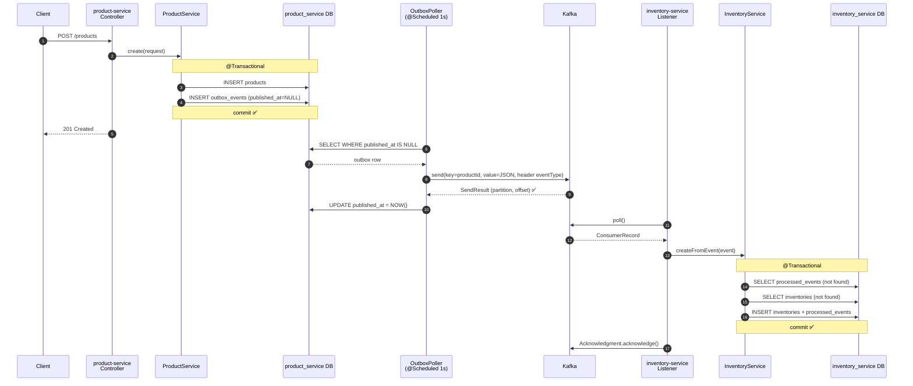
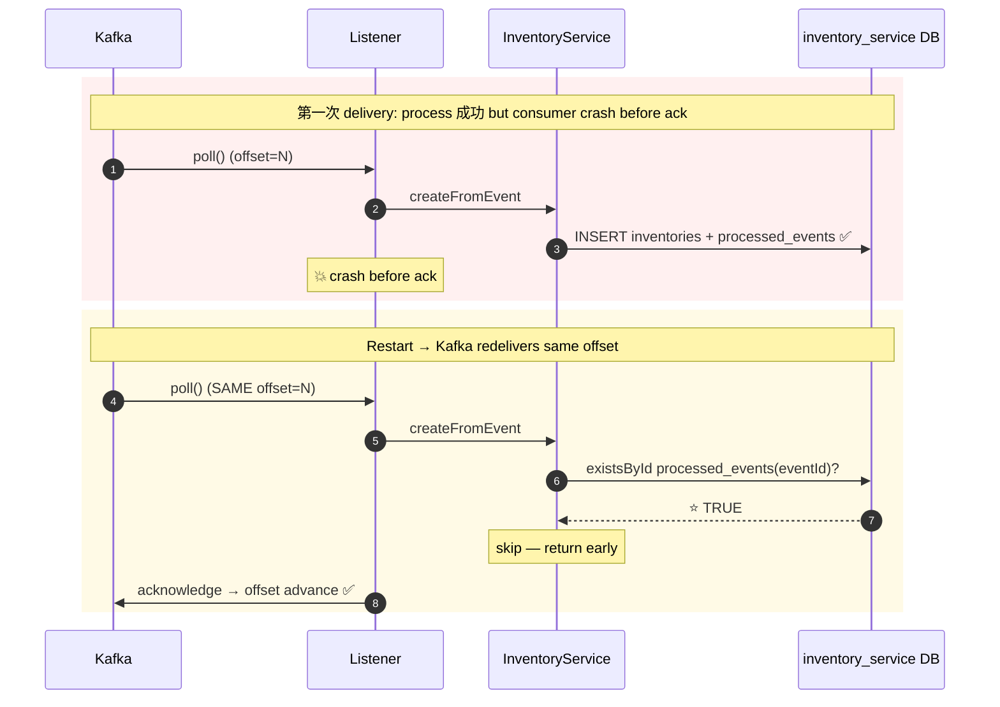

# Lesson 06 — Cross-Service Event Consumption via Kafka

> **Goal**: 第一個**真正 cross-service event-driven flow** 落地 — `product-service` 嘅 outbox poller 由「console-log」變「publish 到 Kafka topic」，新起嘅 `inventory-service` 透過 `@KafkaListener` consume `ProductCreatedEvent`，自動 initialise inventory row。
>
> **Scope reminder**: 重點係**at-least-once delivery semantics + idempotent consumer + 3-leg reliability architecture**，唔係 throughput / latency optimisation。Single-broker dev cluster + manual topic creation；schema registry / DLQ / consumer lag monitoring 留低到 L8 / L9。

---

## Learning Objectives

到 L6 完，你應該答得到：

1. 點解 microservices 之間用 Kafka 而唔係 RabbitMQ / direct REST — 從 commit log durability、replay、multi-consumer fan-out 3 個 axis
2. **Dual write problem** 嘅本質 — 點解 outbox 同 Kafka **缺一不可**，唔係「有 Kafka 就唔需要 outbox」
3. Kafka delivery semantics — 點解 industry default 係 **at-least-once + idempotent consumer**，唔係 exactly-once
4. **Partition key 策略** — 點解用 `productId` 而非 random / composite — affinity vs uniqueness 嘅 misconception
5. **Consumer group ID** 嘅 semantic — same group = workload sharing，different group = independent fan-out
6. Spring Kafka `AckMode` 4 種選擇嘅 trade-off — 點解揀 `MANUAL_IMMEDIATE` 配 at-least-once
7. **Idempotent consumer pattern** — 點解 dedup by `eventId` 而非 `aggregateId`；2-tier guard (processed_events + business-state defensive)
8. **The 3-leg reliability architecture** — producer outbox + Kafka transport + consumer dedup 三條腿缺一不可

---

## 1. Kafka Infra Setup — Shared Cluster at Root

### Placement decision

| Component | Lives in | Why |
|---|---|---|
| `docker-compose.kafka.yml` | **Repo root** | Shared by 2+ services |
| `docker-compose.yml` (MySQL) | Per-service folder | Each service own DB |

Cross-service shared infra **唔放任何單一 service 入面** — 否則 service 之間就有 implicit ordering (e.g. "你要先 cd 入 product-service 啟動 Kafka 先" — Distributed Monolith flavour)。

### Image choice — Confluent over Bitnami

`confluentinc/cp-kafka:7.5.0` + `cp-zookeeper:7.5.0`：

- 99% online tutorials / StackOverflow / blog 都用 Confluent — Google error 容易搵答案
- `cub` (Confluent Utility Belt) 內置 — 提供 `cub zk-ready`、`cub kafka-ready` 等 healthcheck utility
- Bitnami 都 work，但 docs less aligned with mainstream

### Zookeeper or KRaft?

Kafka 3.x 開始支援 **KRaft mode** (no ZK)。L6 故意用 **ZK + Kafka** 兩 container 設計，原因：

- Pedagogical clarity — "Broker (Kafka) + Coordinator (ZK)" 概念分開
- Industry reality — 大部分 existing production Kafka cluster 仍然行 ZK，KRaft GA 喺 2023 (Kafka 3.5)，遷移仲喺進行中
- Cross-reference — L5 hw Q4 Zookeeper ephemeral sequential 嘅 mental model 一致

**Real-world note**: greenfield 新 project 直接落 KRaft fine，但 understand ZK-based deployment 仍然 essential。

### Dual Listener Pattern — THE config trap

```yaml
KAFKA_LISTENERS: PLAINTEXT://0.0.0.0:9092,EXTERNAL://0.0.0.0:9094
KAFKA_ADVERTISED_LISTENERS: PLAINTEXT://kafka:9092,EXTERNAL://localhost:9094
```

**Why dual listener？**

```
Docker Network "kafka-net"
┌─────────────────────────────┐
│   kafka-broker container    │
│   listens on TWO ports:     │
│   - :9092 (internal)        │
│   - :9094 (external)        │
│                              │
│   kafka-ui ───────────────►:9092 (uses container DNS "kafka")
└────────┬────────────────────┘
         │ port mapping 9094:9094
         ▼
┌─────────────────────────────┐
│   HOST (your laptop)        │
│   product-service ─────────►:9094 (uses localhost)
│   inventory-service ───────►:9094
└─────────────────────────────┘
```

**Advertised listener** 係 broker 回覆 client 嘅「下次連我用呢個 address」。如果 advertised 寫錯做 `kafka:9092`，host 上嘅 Spring app 解析唔到 Docker 內部 DNS → 永遠 timeout。**每個第一次玩 Kafka + Docker 嘅人都會踩呢個坑。**

### Disable auto-create topics

```yaml
KAFKA_AUTO_CREATE_TOPICS_ENABLE: "false"
```

預設 client publish 去唔存在嘅 topic → Kafka 自動創建 (1 partition, replication 1)。Dev 似乎方便，**production 災難**：

- Typo `produc-events` 漏個 t → 自動創錯 topic，event 全部去咗錯 topic
- 默認 1 partition → 永遠 hot partition
- Replication 1 → broker 死 = data 丟

**Discipline：強迫 explicit topic creation**，唔靠 Kafka magic。

### Healthcheck gotcha — ZK 4-letter words

`cp-zookeeper:7.5.0` 容器**冇 install `nc`** (netcat)，而且預設 enabled 4-letter words 只有 `srvr`，**`ruok` disabled**。所以 `echo ruok | nc -w 2 localhost 2181 | grep -q imok` 必然 fail。

**Fix — `cub zk-ready`**：

```yaml
healthcheck:
  test: ["CMD-SHELL", "cub zk-ready localhost:2181 5"]
```

`cub` 係 Confluent 官方 blessed utility，return exit 0 if ZK ready。

---

## 2. Producer Side — OutboxPoller → Kafka

### Dependency + config

`services/product-service/pom.xml`：

```xml
<dependency>
    <groupId>org.springframework.kafka</groupId>
    <artifactId>spring-kafka</artifactId>
</dependency>
```

`application.yml`：

```yaml
spring:
  kafka:
    bootstrap-servers: ${KAFKA_BOOTSTRAP:localhost:9094}
    producer:
      key-serializer:   org.apache.kafka.common.serialization.StringSerializer
      value-serializer: org.apache.kafka.common.serialization.StringSerializer
      acks: all
      retries: 3
      properties:
        enable.idempotence: true
        max.in.flight.requests.per.connection: 5
        delivery.timeout.ms: 10000
        request.timeout.ms: 5000
```

### Config trade-off cheatsheet

| Config | 設定 | Why |
|---|---|---|
| `acks: all` | Leader 等所有 in-sync replica ack 先 return | 最強 durability；single-broker 等同 acks=1 |
| `enable.idempotence: true` | Producer 加 sequence number → broker dedup retry | 防 broker-side duplicate from producer retry |
| `retries: 3` | 失敗 auto retry 3 次 | Network glitch tolerant |
| `delivery.timeout.ms: 10000` | 整個 send 操作 max 10 sec | 防止 broker hang 累死 transaction |
| **Sync `.get()` in poller** | 等 broker ack 先 mark published_at | **at-least-once 嘅 cornerstone** |

### OutboxPoller — at-least-once 落地

```java
@Scheduled(fixedDelayString = "${app.outbox.poll-interval-ms:1000}")
@Transactional
public void publishPending() {
    List<OutboxEvent> pending = outboxRepo.findTop100ByPublishedAtIsNullOrderByIdAsc();
    if (pending.isEmpty()) return;

    Instant now = Instant.now();
    for (OutboxEvent event : pending) {
        if (publish(event)) {
            event.setPublishedAt(now);  // ⭐ broker ack 後先 mark
        }
        // 失敗：published_at 留 null → 下個 poll 再 retry
    }
    outboxRepo.saveAll(pending);
}

private boolean publish(OutboxEvent event) {
    ProducerRecord<String, String> record = new ProducerRecord<>(
            productEventsTopic,
            null,                          // partition: hash partition key
            event.getAggregateId(),        // ⭐ key = productId → same partition per product
            event.getPayload()
    );
    record.headers().add(new RecordHeader("eventType",
            event.getEventType().getBytes(StandardCharsets.UTF_8)));

    try {
        SendResult<String, String> result = kafkaTemplate.send(record).get();  // ⭐ sync wait
        return true;
    } catch (Exception e) {
        log.error("publish FAILED — will retry next poll", e);
        return false;
    }
}
```

### Key design decisions

1. **Sync `.get()` instead of fire-and-forget** — 如果 broker down 而 `.send()` 唔等 ack 直接 return，你會 mark published_at = NOW() 但 event 其實丟咗
2. **Per-event failure isolation** — 一條 event 失敗唔會 abort 整個 batch；其他 event 仍然 mark published
3. **partition key = aggregateId (productId)** — 同一 product 嘅 future event (`ProductPriceUpdated`, `ProductDeleted`) 必然落同一 partition → consumer 嚴格 FIFO order
4. **`eventType` header** — consumer 唔需要 parse JSON body 就可以 route，efficient + clean separation

---

## 3. inventory-service Scaffold — 3rd Microservice

### Port allocation

| Service | App port | MySQL host port | Adminer |
|---|---|---|---|
| user-service | 8080 | 3307 | 8090 |
| product-service | 8082 | 3308 | 8091 |
| **inventory-service** | **8083** | **3309** | **8092** |

⚠️ **Hyper-V reserved port range trap**：Windows + Docker Desktop / WSL2 隨機 reserve dynamic port ranges 畀 virtualization。`spring-boot:run` 報 "8083 already in use" 但 `netstat -aon | findstr :8083` 見唔到任何 process — 因為**根本冇 process bound**，OS 早早 reserve 咗。

**Diagnose**:
```powershell
netsh interface ipv4 show excludedportrange protocol=tcp
```

**Fix options**: 揀另一 port (8084, 8085) OR (admin shell) `netsh int ipv4 add excludedportrange ...` 永久 reserve 自己用嘅 range。

### Module structure

```
services/inventory-service/
├── pom.xml                         # spring-boot-starter-web/jpa, spring-kafka, lombok, mysql, flyway
├── docker-compose.yml              # MySQL on 3309, Adminer on 8092
└── src/main/
    ├── java/com/onlineshopping/inventory/
    │   ├── InventoryServiceApplication.java  # @EnableKafka
    │   ├── entity/                            # Inventory, ProcessedEvent
    │   ├── repository/                        # JpaRepository
    │   ├── event/                             # ProductCreatedEvent (mirror)
    │   ├── service/                           # InventoryService
    │   └── listener/                          # ProductEventListener
    └── resources/
        ├── application.yml
        └── db/migration/V1__init_inventory_schema.sql
```

⚠️ **Package discipline** — L5 撞過 IntelliJ "Rename Package" 整錯 `com.onlineshopping.product` package 入面 user-service 嘅 file。今次 scaffold 每個 file 嘅 `package` declaration 都要係 `com.onlineshopping.inventory.*`。

### Schema design

```sql
CREATE TABLE inventories (
    product_id      BIGINT       NOT NULL,    -- 1:1 with products (no separate Snowflake)
    stock_quantity  INT          NOT NULL DEFAULT 0,
    version         BIGINT       NOT NULL DEFAULT 0,  -- @Version optimistic lock
    created_at      TIMESTAMP(6) NOT NULL DEFAULT CURRENT_TIMESTAMP(6),
    updated_at      TIMESTAMP(6) NOT NULL DEFAULT CURRENT_TIMESTAMP(6) ON UPDATE CURRENT_TIMESTAMP(6),
    PRIMARY KEY (product_id),
    CONSTRAINT chk_stock_non_negative CHECK (stock_quantity >= 0)
);

CREATE TABLE processed_events (
    event_id      VARCHAR(36) NOT NULL,        -- UUID string from event payload
    event_type    VARCHAR(64) NOT NULL,
    processed_at  TIMESTAMP(6) NOT NULL DEFAULT CURRENT_TIMESTAMP(6),
    PRIMARY KEY (event_id)
);
```

### Why `product_id` as natural PK (no separate Snowflake)?

- Inventory 同 Product 係 **1-to-1 relationship**
- product_id 本身已經 globally unique (Snowflake)
- 加多一個 inventory_id Snowflake 純粹 noise，無 business value

**Compare**：products 表用 separate Snowflake 因為 SKU / external reference / cross-aggregate refer 都需要穩定 ID。Inventory 只係 product 嘅 attribute extension。

---

## 4. Consumer Wiring — @KafkaListener + MANUAL_IMMEDIATE

### Consumer config

```yaml
spring:
  kafka:
    bootstrap-servers: ${KAFKA_BOOTSTRAP:localhost:9094}
    consumer:
      group-id: inventory-service
      auto-offset-reset: earliest
      enable-auto-commit: false                    # ⭐ 禁 Kafka native auto-commit
      key-deserializer:   org.apache.kafka.common.serialization.StringDeserializer
      value-deserializer: org.apache.kafka.common.serialization.StringDeserializer
    listener:
      ack-mode: MANUAL_IMMEDIATE                   # ⭐ 由 application 控制 commit
      missing-topics-fatal: false
```

### Group-ID semantic — common misconception

**Misconception**：「Consumer group-id 描述邊個 producer publish」 — ❌ 錯。Producer **完全唔知 consumer 嘅存在**。

**Real model**：

```
Topic: product-events (8 partitions)
  Group "inventory-service" — 3 instances
    Instance 1 reads partitions 0,1,2  ┐
    Instance 2 reads partitions 3,4,5  ├─ Same group = load balance
    Instance 3 reads partitions 6,7    ┘     每個 message 整個 group 處理一次
  
  Group "audit-service" — 2 instances
    Instance 1 reads partitions 0-3    ┐
    Instance 2 reads partitions 4-7    ┴─ Different group = independent fan-out
                                          收齊全部 message，獨立 offset
```

Group-id naming convention：**one consumer group per logical service** (`inventory-service`)，唔需要包 topic name。

### AckMode 4 choices

| AckMode | 行為 | 適合場景 |
|---|---|---|
| `RECORD` | 每條 message Spring 自動 commit | Spring control，application 唔知時機 |
| `BATCH` (Spring default) | Listener 整個 poll batch return successfully 之後 commit | Partial commit issue if fail mid-batch |
| `MANUAL` | Application `Acknowledgment.acknowledge()` queue commit | Commit 滯後 (next poll boundary) |
| **`MANUAL_IMMEDIATE`** ⭐ | Application `acknowledge()` 即時 synchronous commit | At-least-once cornerstone — business write + offset commit aligned |

### ProductEventListener

```java
@KafkaListener(
        topics = "${app.kafka.topic.product-events}",
        groupId = "${spring.kafka.consumer.group-id}"
)
public void onProductEvent(ConsumerRecord<String, String> record, Acknowledgment ack) {
    String eventType = readHeader(record, "eventType");

    try {
        switch (eventType == null ? "" : eventType) {
            case "ProductCreated" -> handleProductCreated(record.value());
            default -> log.info("Ignoring unhandled event type: {}", eventType);
        }
        ack.acknowledge();   // ⭐ business write 成功先 commit offset
    } catch (Exception e) {
        log.error("Failed — NOT committing offset, will retry", e);
        throw new RuntimeException("Listener processing failed", e);
    }
}
```

### Key design decisions

1. **`ConsumerRecord<String, String>`** — 拎全部 metadata (partition, offset, headers, key)，唔淨係 message body
2. **Switch by `eventType` header** — 無需 parse JSON 就 route，efficient
3. **`ack.acknowledge()` 喺 try block 最後** — business write succeed 先 commit offset
4. **Catch + re-throw** — Spring container 收到 throw → 默認 retry policy → 唔 commit offset → next poll 重 deliver

---

## 5. Idempotency — `processed_events` 2-tier dedup

### Why dedup by `eventId`，唔係 `productId`

| | Dedup by productId | Dedup by eventId ⭐ |
|---|---|---|
| ProductCreated | ✅ works (1 product = 1 create) | ✅ works |
| ProductPriceUpdated (future) | ❌ same productId 多次 update — 全部誤判 duplicate | ✅ 每 update 獨立 eventId |
| ProductDeleted | ❌ Same problem | ✅ works |
| Cross-aggregate events | ❌ Tightly coupled | ✅ Universal |

`eventId` (UUID from producer) 係**每 event 嘅唯一指紋**，universal 適用任何 event type。

### Two-tier guard

```java
@Transactional
public void createFromEvent(ProductCreatedEvent event) {
    // First guard: dedup by eventId (handles consumer redelivery)
    if (processedEventRepo.existsById(event.eventId())) {
        log.info("Duplicate event delivery — skipping eventId={}", event.eventId());
        return;
    }

    // Second guard: defensive — inventory exists but dedup missing
    // (e.g. offset reset replay against pre-existing data, manual ops)
    if (inventoryRepo.existsById(event.productId())) {
        log.info("Inventory row already exists — recording dedup only");
    } else {
        Inventory inv = Inventory.builder()
                .productId(event.productId())
                .stockQuantity(0)
                .build();
        inventoryRepo.save(inv);
    }

    ProcessedEvent dedup = ProcessedEvent.builder()
            .eventId(event.eventId())
            .eventType(event.eventType())
            .build();
    processedEventRepo.save(dedup);
}
```

### Why 2 guards?

| Scenario | First guard hit? | Second guard hit? | Outcome |
|---|---|---|---|
| New event, new product (happy path) | No | No | INSERT both |
| Consumer redeliver (crashed before ack) | **Yes** | — | Skip everything |
| Offset reset replay vs existing inventory | No | **Yes** | Skip inventory INSERT, write dedup |

**2nd guard 點解需要？** 一旦 consumer group offset 被 reset (operational concern)，**existing inventory rows 已 commit 但對應 dedup 紀錄唔存在** (torn state)。冇 second guard → 即時撞 `DuplicateKeyException` 卡死 consumer。

### Same `@Transactional`

Inventory write + dedup record 兩個 INSERT 喺**同一 DB transaction**。Crash 喺中間 → 一齊 rollback → 下次 retry 由 scratch。**永遠唔會出現「inventory 寫咗但 dedup 冇」嘅 split-brain。**

---

## 6. The 3-Leg Reliability Architecture

整個 L6 嘅 design pattern 可以總結為**3 條腿**，缺一不可：

```
┌─────────────────────────────────┐
│  Producer (product-service)     │
│  [DB write] + [Outbox INSERT]   │ ← LEG 1: Producer-side atomicity
│  SAME DB TRANSACTION ✅          │
└──────────┬──────────────────────┘
           │ (Poller, eventually)
           ▼
┌─────────────────────────────────┐
│  Kafka topic product-events     │ ← LEG 2: Durable transport
│  - Commit log retained          │       + multi-consumer fan-out
│  - Partitioned by productId     │       + replay capability
└──────────┬──────────────────────┘
           │
           ├──→ inventory-service consumer
           ├──→ audit-service consumer (future L9)
           └──→ search-indexer consumer (future L10)
                  │
                  ▼
        ┌─────────────────────────┐
        │  Consumer               │
        │  IF processed_events    │
        │     contains eventId    │
        │  THEN skip              │ ← LEG 3: Consumer-side idempotency
        │  ELSE process + record  │
        └─────────────────────────┘
```

| Leg | Solves | Without it... |
|---|---|---|
| **1. Outbox (producer DB)** | Dual write problem — DB ≠ Kafka 唔同 system，冇 distributed txn | Event 隨機丟 / phantom event published |
| **2. Kafka (transport)** | Producer / consumer coupling、consumer downtime、加新 consumer | Tight coupling，加 consumer 要改 producer，cascading failure |
| **3. Idempotent consumer** | At-least-once → duplicates inevitable | Duplicate process → DuplicateKey 爆 / 重複扣 stock / double-charge |

**任何 production event-driven system 都需要呢 3 條腿。** 缺一條都係 silent corruption 嘅 source。

### 對稱觀察

兩邊 service 都係 **2-row atomic write**：

| Side | Write 1 | Write 2 | Atomic via |
|---|---|---|---|
| Producer | `INSERT products` | `INSERT outbox_events` | Same product_service DB transaction |
| Consumer | `INSERT inventories` | `INSERT processed_events` | Same inventory_service DB transaction |

**呢個對稱唔係巧合** — 兩邊都係**將「dual write」收回單一 DB transaction**。用同一 trick 換取 cross-system reliability。

---

## 7. Cross-Service Event Design — DTO Separation

### No cross-service Maven dependency (L5 lesson learned)

❌ **錯**：

```xml
<!-- inventory-service/pom.xml -->
<dependency>
    <groupId>com.onlineshopping</groupId>
    <artifactId>product-service</artifactId>   <!-- Distributed Monolith! -->
</dependency>
```

✅ **對**：每個 service own 自己嘅 DTO version，event JSON 係 contract：

```java
// inventory-service 自己嘅 ProductCreatedEvent
@JsonIgnoreProperties(ignoreUnknown = true)
public record ProductCreatedEvent(
        String eventId,
        String eventType,
        Integer eventVersion,
        Instant occurredAt,
        Long productId,
        String name,
        String sku,
        Long priceCents,
        String currency,
        Long categoryId,
        String status
) {}
```

### Why `@JsonIgnoreProperties(ignoreUnknown = true)`

**L5 hw Q2a 嘅落地證明**。Producer 將來加 nullable field (e.g. `discountedPriceCents`) → 舊 consumer 嘅 DTO 無呢 field → Jackson **靜默 ignore unknown** → 唔需要 consumer 改任何 code。

**Rule of thumb**：
- Adding optional field → backward compatible，consumer 唔需要改
- Removing field / changing type / changing semantic → 升 event version，dual-publish rollout

---

## 8. Testing Strategy

### Test pyramid for L6

| Layer | What we test | Files |
|---|---|---|
| Unit (producer) | OutboxPoller — KafkaTemplate sync.get(), partition key, header, failure isolation | `OutboxPollerTest.java` |
| Unit (consumer) | InventoryService — 3 idempotency paths | `InventoryServiceTest.java` |
| Integration | Listener wire + full publish-consume cycle | Deferred to homework (`@EmbeddedKafka`) |

### OutboxPollerTest (3 paths)

| Test | Assertion |
|---|---|
| `publishesPending_setsPublishedAt_whenKafkaAcks` | `published_at` set + ProducerRecord 有對 topic/key/header |
| `leavesPublishedAtNull_whenKafkaFails_forRetryNextPoll` | **No throw** + `published_at` 留 null → 下次 retry |
| `noOp_whenNoPending` | Zero KafkaTemplate interaction |

### InventoryServiceTest (3 paths)

| Test | Path |
|---|---|
| `happyPath_savesInventoryAndDedupRecord` | First guard miss + second guard miss → both INSERT |
| `duplicateEvent_skipsAllWrites` | First guard hit → no DB writes |
| `inventoryExistsButNoDedup_skipsInventoryAndOnlyRecordsDedup` | First guard miss + second guard hit → write only dedup |

### Mocking Spring `@Value` field

`ReflectionTestUtils.setField(poller, "productEventsTopic", "product-events")` — Mockito constructor injection 唔處理 `@Value`，要 reflection 手動 set。

---

## 9. Sequence Diagrams

### Happy path — new product first-time create



### Duplicate delivery scenario — idempotency guards 守住



---

## 10. Bugs Hit / War Stories

### 1. Zookeeper healthcheck — `nc` missing + `ruok` disabled

第一次 `docker compose up -d` → ZK container 起到，但 healthcheck `echo ruok | nc -w 2 localhost 2181 | grep -q imok` 永遠 fail → dependency `kafka-broker` start 唔到。

**Root cause** (兩個疊埋)：
- `cp-zookeeper` image 唔 install `nc`
- ZK 3.6+ 預設 `ruok` 4-letter word disabled (enabled list = `[srvr]`)

**Diagnose**：先讀 ZK log confirm ZK 本身 healthy，唔係 trust error message narrative。

**Fix**: `cub zk-ready localhost:2181 5` (Confluent 內置 utility)。

### 2. Hyper-V port range reservation

Inventory-service `spring-boot:run` 報 "Web server failed to start. Port 8083 was already in use"，但 `netstat -aon | findstr :8083` 見唔到任何 process listening。

**Root cause**: Windows + Docker Desktop / WSL2 隨機 reserve dynamic port range 畀 Hyper-V virtualization。Port 落喺 reserved range → OS 唔畀 user-space bind，但都唔顯示為 occupied。

**Diagnose**: `netsh interface ipv4 show excludedportrange protocol=tcp`。

**Fix**: 揀另一個 port (8084) 或者 admin shell explicit reserve range 畀自己用。

### 3. Replay duplicate after offset reset → DuplicateKeyException

Demonstration step：reset consumer group offset to 0 → restart inventory-service → 即時撞 `Duplicate entry '<productId>' for key 'inventories.PRIMARY'`。Spring container catch + re-throw → infinite retry loop → consumer 卡死。

**Lesson**: at-least-once **本身唔解決問題** — 必須配 consumer-side idempotency。**Naked save() = bug**。

**Fix**: `processed_events` table + 2-tier guard。

### 4. Torn state — inventory exists but no dedup record

加咗 first guard (`processedEventRepo.existsById`) 仲未夠。Pre-existing inventory rows (從 L6.5 hands-on demo 留低) 撞 second time replay → first guard miss (從未寫 processed_events) → try `inventoryRepo.save` → 又撞 DuplicateKey。

**Fix**: 加 second guard `inventoryRepo.existsById(productId)` → skip business write 但仍然寫 dedup record (將 torn state 修補)。

### 5. `initialStock: 200` silently dropped (data flow gap)

POST /products `{...initialStock: 200}` → inventory row stock=0。
**Root cause** (3 layer silent drop)：
- `CreateProductRequest` 冇 `initialStock` field → Jackson ignore unknown
- `ProductCreatedEvent` payload 都冇
- `InventoryService.createFromEvent` hardcoded 0

**Not a bug** — L6 deliberate scope simplification。Production properly support 應該係 separate `POST /inventory/{id}/stock` endpoint，product create 同 stock allocation 解耦 (Amazon-style "back-order" semantics)。

### 6. Mockito constructor injection 唔 inject @Value

OutboxPollerTest 第一次 run → `productEventsTopic` 係 null → ProducerRecord 報 "Topic name cannot be null"。

**Root cause**: `@InjectMocks` 用 constructor injection。`@Value` 係 field injection，由 Spring context 處理 — Mockito 唔 cover。

**Fix**: `ReflectionTestUtils.setField(poller, "productEventsTopic", "product-events")` 喺 `@BeforeEach`。

---

## 11. Production Gaps Documented

呢一課**有意 cut corner** 嘅地方 — 將來 lesson 會處理：

| Gap | 將來邊一課 | Why deferred |
|---|---|---|
| 1. Single-broker dev cluster (no HA) | L13 (production hardening) | Need ≥3 brokers for ISR replication |
| 2. Auto-create topics disabled but冇 production topic management tooling | L13 | Production needs IaC (Terraform Kafka provider) |
| 3. No Dead Letter Queue (DLQ) — failed messages infinite retry | L6 homework Q1 | Need explicit Spring `DeadLetterPublishingRecoverer` |
| 4. Synchronous `.get()` blocks DB transaction long | L8 (scaling) | Need async send + batch ack pattern |
| 5. Outbox poll delay up to 1s (`fixedDelay`) | L9 (perf) | PostgreSQL `LISTEN/NOTIFY` or MySQL CDC for sub-100ms latency |
| 6. Snowflake `worker_id` hardcoded 1 | L8 (Zookeeper allocation) | L5 hw Q4 pseudo-code落地 |
| 7. No consumer lag monitoring | L11 (observability) | Need Prometheus + JMX + Grafana dashboard |
| 8. No schema registry — schema drift undetected | L9 (data quality) | Confluent Schema Registry / Apicurio integration |
| 9. No partition rebalance hook (state cleanup) | L8 | `ConsumerRebalanceListener` + idempotent re-init |
| 10. `ack-mode: MANUAL_IMMEDIATE` per-record (slow) | L8 | MANUAL batch ack pattern |

呢個 list 寫低係 senior signal — **明知 cut corner 嘅技術 debt，唔係 oversight**。

---

## 12. Interview Prep Q&A

### Q1 — 點解需要 outbox 如果已經有 Kafka？

**Answer**：解決 **dual write problem**。Business DB 同 Kafka 係兩個 system，冇 distributed transaction。任何 `repo.save()` + `kafkaTemplate.send()` 嘅 naive pattern 都有 race：

- DB commit 後 Kafka fail → event 永遠丟
- Kafka 成功後 DB rollback → phantom event (consumer 見到唔存在嘅 entity)

Outbox 將 dual write 收回 **single DB transaction** (product + outbox row 一齊 commit)，poller 後續 eventually deliver。Eventual consistency 換取絕對唔丟 event。

### Q2 — At-least-once vs Exactly-once

- **At-most-once**: 可能丟 message (commit-then-process)
- **At-least-once**: 可能 duplicate (process-then-commit) — **industry default + idempotent consumer**
- **Exactly-once**: 理論上要 distributed 2PC across Kafka + DB — Kafka EOS (2017) 只 cover Kafka producer → broker → consumer 嘅 closed loop，**唔 cover Kafka → external DB**

Production 99% 揀 at-least-once + idempotent consumer，因為 2PC fragile + slow。Pat Helland: *"There is no such thing as exactly-once delivery in a distributed system."*

### Q3 — Partition key 點揀？

**Affinity / locality / ordering**，**唔係 uniqueness**。

- 用 `productId` → 同一 product 嘅所有 event 落同一 partition → consumer 內 strict FIFO
- 用 random key / composite (productId + timestamp) → 散到唔同 partition → **out-of-order delivery → business logic 爆**
- Hot partition trade-off — 一個 viral product 集中一 partition，consumer thread bottleneck。Mitigation: sub-key sharding (犧牲 strict order) / pre-split hot keys / separate topic

### Q4 — Consumer group ID 點 design？

**One consumer group per logical service** (`inventory-service`)。

- Same group + multi instance → load balance (Kafka 自動 partition assignment)
- Different group → independent fan-out，獨立 offset，**producer 完全唔知**
- L9 加 audit-service → 新 group `audit-service`，零 producer change

### Q5 — Idempotent consumer 點實現？4 種方法 trade-off？

| 方法 | Pro | Con |
|---|---|---|
| Catch DuplicateKeyException | 簡單 | 只 work for INSERT-only event |
| Upsert (`INSERT ... ON DUPLICATE KEY UPDATE`) | DB-native idempotent | 唔 work for "stock += 5" 嘅 increment |
| **`processed_events` table** ⭐ | Universal，work for 任何 business logic | Multi table + 100B overhead per event |
| Redis dedup cache | Sub-ms lookup | Redis crash = 失去 state；TTL < Kafka retention = break |

L6 揀 `processed_events` table — 為將來 `ProductPriceUpdated` 等 complex business logic 預留 framework。

### Resume bullets (適合 senior backend engineer 簡歷)

- Designed and implemented event-driven microservices communication using Apache Kafka with at-least-once delivery semantics and idempotent consumer pattern
- Applied **Transactional Outbox pattern** to solve dual-write problem; **achieved zero event loss** under producer-side failure scenarios via synchronous broker acknowledgment
- Built **2-tier idempotency guard** (dedup table + business-state defensive check) handling consumer redelivery, offset reset replay, and torn-state recovery
- Configured **MANUAL_IMMEDIATE ack mode** with `Acknowledgment.acknowledge()` to align Kafka offset commit with business transaction success

---

## 13. Homework / Reflection

完 lesson 之前自問（解答喺 L7 開始時 fold 入 collapsible block）：

1. **Dead Letter Queue (DLQ)** 落地 — 你嘅 listener 而家 throw RuntimeException → Spring 默認 `SeekToCurrentErrorHandler` retry forever (或者 10 attempts depending on version)。寫出**完整 DLQ wiring**：(a) configure `DefaultErrorHandler` + `DeadLetterPublishingRecoverer`，(b) create dedicated topic `product-events.DLT`，(c) DLQ message metadata 應該包乜 (original topic / partition / offset / exception class / stack trace)。如果 DLQ 自己都 fail，最後 last-resort 點處理？

2. **`@EmbeddedKafka` integration test** — 寫一個完整 integration test：用 `@SpringBootTest` + `@EmbeddedKafka` + `@AutoConfigureMockMvc` + Testcontainers MySQL，verify (a) POST /products → outbox row written，(b) 1 秒內 Kafka topic 收到 1 message，(c) inventory-service consumer process 完 → `inventories` 多咗 row。點 await async event without flaky `Thread.sleep`？(hint: `Awaitility`)

3. **Schema versioning rollout** — 假設你下個月要將 `ProductCreatedEvent` v1 → v2，加 `discountedPriceCents Long` (nullable additive)。寫出 **producer-side dual publish strategy**：(a) Topic naming `product-events-v1` + `product-events-v2`？定 single topic + version header？(b) Consumer migration sequence — 3 個 consumer service (inventory, audit, search) 點逐個 cut over？(c) Deprecation window 完點 cleanup？同 Confluent Schema Registry 嘅 forward / backward / full compatibility setting 對應點？

4. **Consumer lag monitoring** — 寫一個 Spring Boot Actuator endpoint `/actuator/kafka-lag` 顯示 `inventory-service` group 對 `product-events` topic **每個 partition 嘅 current offset、log end offset、lag**。提示：用 Kafka `AdminClient` API。如果某個 partition lag > 10000 → trigger Prometheus alert，PagerDuty page on-call — 寫 pseudo-code wiring。

5. **KRaft mode migration** — 你嘅 docker-compose 用 Zookeeper。寫出 migration steps：(a) 點 prepare Kafka cluster (3 brokers → 3 KRaft controllers)？(b) `kafka-storage` CLI 嘅 format step 做咩？(c) Rolling restart sequence — broker by broker upgrade 同 metadata migrate 順序？(d) **Risk** — 如果 mid-migration controller quorum 失敗，點 rollback？

<details>
<summary><strong>📖 Polished Solutions (L7 session fold-back)</strong></summary>

> 小V 嘅 cold-attempt notes:
> - **Q1.1-1.3**: 答得好 — `product-events.DLT` naming convention + metadata 內容都 bullseye
> - **Q1.4 (transient vs permanent)**: cold — 教咗 mental model
> - **Q2**: 只 self-aware 答到 `Thread.sleep` + 自己已 doubt "失去 async 意義" — senior thinking 起點，淨係未識個 library 名 `Awaitility`
> - **Q3**: 「v1 / v2 topic naming」方向啱、incomplete — miss 咗 in-payload version + schema registry 兩條 dimension
> - **Q4 / Q5**: cold surrender — 全新 production-ops concept，要做過 oncall / migration 先會熟

---

### Q1 — Dead Letter Queue Wiring

**Why DLQ exists：** L6 hands-on 撞過 war story #3 — `DuplicateKeyException` 引發 consumer 無限 retry loop，partition lag 失控累積。Production reality 係：有啲 message 真係 **poison** (payload corrupted、unparseable JSON、refer 不存在 entity)。冇 DLQ 嘅後果 — consumer 永遠 stuck 喺嗰條 poison message，後面成千上萬條 valid event 等住。**DLQ 嘅 purpose 唔係保住嗰條 poison message，係保住「後面所有 valid message」嘅 throughput。**

#### Retry policy + backoff

| Backoff strategy | 適用場景 |
|---|---|
| `FixedBackOff(1000ms, 3)` | 簡單、predictable — 適合 transient 故障 likely 快速恢復 |
| **`ExponentialBackOff(1s → 2s → 4s, max 10s)`** ⭐ | Production default — 避免 thundering herd，downstream overload 嘅時候 polite 退讓 |

Spring Kafka **default** 係 `FixedBackOff(0L, 9L)` — 0ms delay × 9 retries = 10 attempts。0ms 解釋咗 L6 war story #3 點解 consumer 瘋狂 retry — default policy 連 1ms 都唔等。Production 一定要 override。

#### Topic naming convention

```
product-events       ← 主 topic
product-events.DLT   ← Spring Kafka DeadLetterPublishingRecoverer default convention
```

`.DLT` = Dead Letter **Topic** (Spring Kafka 嘅 trademark 命名)。識呢條 convention = 用過 Spring Kafka in production 嘅 signal。

#### DLT message metadata (Spring 自動帶)

```
kafka_dlt-original-topic           = "product-events"
kafka_dlt-original-partition       = 2
kafka_dlt-original-offset          = 145782
kafka_dlt-original-timestamp       = 1716123456789
kafka_dlt-exception-fqcn           = "org.springframework.dao.DataIntegrityViolationException"
kafka_dlt-exception-message        = "Duplicate entry '315140602960416768'..."
kafka_dlt-exception-stacktrace     = "...full stack..."
```

**Why 要全部留：** 之後人工 review DLT 需要 (a) original topic/partition/offset 做 replay，(b) exception class 做分類，(c) stack trace 做 forensic。淨係留 payload 等於 "證物冇 chain of custody"。

#### Transient vs Permanent — 核心 mental model

| Type | 例子 exceptions | Retry? | Why |
|---|---|---|---|
| **Transient** (網絡 / contention) | `SocketTimeoutException`, `TransientDataAccessException`, `OptimisticLockException`, `KafkaTimeoutException` | ✅ Retry with backoff | 過陣會自己好返 — DB momentary spike、concurrent write conflict、network glitch |
| **Permanent** (data shape / business rule) | `DataIntegrityViolationException`, `JsonParseException`, `MethodArgumentNotValidException`, `IllegalArgumentException` | ❌ Instant DLT | Retry 1000 次都同一個 exception — 浪費 cycles + block pipeline |

呢個 classification 就係 L6 war story #3 嘅 root cause —`DuplicateKeyException` 屬於 **permanent** 但 Spring default policy retry 緊。完整 fix = dedup guard (prevention) + DLQ classification (containment) 兩層都要有。

#### Complete Spring Kafka wiring

```java
@Configuration
public class KafkaErrorHandlerConfig {

    @Bean
    public DefaultErrorHandler kafkaErrorHandler(KafkaTemplate<String, String> template) {
        // ① DLT recoverer — 寄去 <originalTopic>.DLT
        var recoverer = new DeadLetterPublishingRecoverer(template);

        // ② Exponential backoff: 1s → 2s → 4s, capped 10s, max 3 retries
        var backoff = new ExponentialBackOff(1000L, 2.0);
        backoff.setMaxInterval(10_000L);
        backoff.setMaxElapsedTime(30_000L);   // 30s 內未成功就 DLT

        var handler = new DefaultErrorHandler(recoverer, backoff);

        // ③ Permanent failures — 跳過 retry，直接 DLT
        handler.addNotRetryableExceptions(
            DataIntegrityViolationException.class,
            JsonParseException.class,
            IllegalArgumentException.class,
            MethodArgumentNotValidException.class
        );

        return handler;
    }
}
```

`ConcurrentKafkaListenerContainerFactory` 入面 inject：

```java
factory.setCommonErrorHandler(kafkaErrorHandler);
```

#### Replay mechanism (interview follow-up)

DLT 唔係終點，係 **quarantine**。Replay pattern：

1. 人工 / batch job 由 `product-events.DLT` 讀返出嚟
2. Inspect exception class + payload，identify root cause + fix
3. 用 `KafkaTemplate` 寄返去 **原 topic** `product-events`
4. Producer 帶原 eventId → consumer-side dedup guard handle 任何 by-product duplicate

#### Last-resort 如果 DLT 自己都 fail

`DeadLetterPublishingRecoverer` send DLT fail (broker down、DLT topic 唔存在) → recoverer 自己 throw → `DefaultErrorHandler` 用 `BackOffHandler` 重試 DLT send → 仍然 fail → 配 `addRetryableExceptions(KafkaException.class)` 並上 ELK alert + page oncall。**呢度唔好再 fallback 第 3 層 — broker down 嘅根本問題唔係 application 解決得到。**

---

### Q2 — `@EmbeddedKafka` Integration Test

**Why integration test 唔可以淨係 unit test：** L6 你寫嘅 Mockito unit test 100% green 都唔代表 end-to-end 真係 work — producer 同 consumer **冇真正過過 broker**。Production reality：

- Producer partition key 正確但 consumer group config 撞咗 → message 永遠 stuck
- Serializer config mismatch → consumer parse 唔到
- Topic auto-create disabled (你 L6 設定) → typo topic 直接 silent skip

Spring Kafka 提供 `@EmbeddedKafka` — 喺 test JVM in-memory boot 一個真 Kafka broker。

#### Race condition — `Awaitility` 取代 `Thread.sleep`

`Thread.sleep(2000)` 嘅 3 個致命問題：

| 問題 | 後果 |
|---|---|
| **Flaky** | CI 機器 load 高 → consumer 用 3s → test fail 但 logic 正確 → build pipeline 紅燈 → trust 下降 |
| **Slow** | Sleep 2s safety buffer，actual 用 200ms → 每 test 浪費 1.8s × N tests |
| **Magic number** | 點解 2s 唔係 3s？冇 reasoning + 冇 docs → 6 個月後同事完全唔知點調 |

**Production standard：Awaitility — polling + assertion + timeout 三合一**

```java
import static org.awaitility.Awaitility.await;
import static java.util.concurrent.TimeUnit.*;

await().atMost(10, SECONDS)
       .pollInterval(200, MILLISECONDS)
       .untilAsserted(() -> 
           assertThat(inventoryRepo.count()).isEqualTo(1)
       );
```

**Sweet spot：**
- Consumer 200ms 搞掂 → test 200ms break，唔等剩低 9.8s
- Consumer hang → 10s timeout 報錯，唔 false-positive
- `pollInterval` 控制頻率 — 200ms 一 check，唔 spam CPU

Maven dependency：

```xml
<dependency>
    <groupId>org.awaitility</groupId>
    <artifactId>awaitility</artifactId>
    <scope>test</scope>
</dependency>
```

#### Test isolation

```java
@SpringBootTest
@EmbeddedKafka(
    partitions = 1,
    topics = {"product-events", "product-events.DLT"},
    brokerProperties = {"listeners=PLAINTEXT://localhost:9092"}
)
class ProductEventListenerIT {

    @Test
    void test1() {
        // 每個 test 用唯一 consumer group ID → offset state 隔離
        String groupId = "test-" + UUID.randomUUID();
        // ...
    }
}

// Heavy hammer：每 test 完 wipe Spring context
@DirtiesContext(classMode = AFTER_EACH_TEST_METHOD)
```

**Trade-off：** Unique groupId 快 (consumer state reset)，但 broker/DB state 留低；`@DirtiesContext` 100% clean 但慢 5-10×。Production project 通常混用 — fast path 用 unique groupId，DB-heavy test 先 `@DirtiesContext`。

#### Complete integration test

```java
@SpringBootTest
@EmbeddedKafka(partitions = 1, topics = {"product-events"})
@AutoConfigureMockMvc
@Testcontainers
class ProductCreatedFlowIT {

    @Container
    static MySQLContainer<?> mysql = new MySQLContainer<>("mysql:8.0");

    @Autowired MockMvc mockMvc;
    @Autowired InventoryRepository inventoryRepo;
    @Autowired OutboxEventRepository outboxRepo;

    @Test
    void postProduct_publishesEvent_consumerCreatesInventory() throws Exception {
        // ① POST /products
        String response = mockMvc.perform(post("/products")
                .contentType(APPLICATION_JSON)
                .content("""
                    {"name":"Widget","sku":"WID-1","priceCents":9900,
                     "currency":"USD","categoryId":1}
                    """))
                .andExpect(status().isCreated())
                .andReturn().getResponse().getContentAsString();
        Long productId = JsonPath.read(response, "$.id");

        // ② Outbox row 立即寫咗
        await().atMost(2, SECONDS).untilAsserted(() ->
            assertThat(outboxRepo.findAll())
                .extracting(OutboxEvent::getAggregateId)
                .contains(productId.toString())
        );

        // ③ Inventory row eventually 出現
        await().atMost(10, SECONDS).untilAsserted(() ->
            assertThat(inventoryRepo.findById(productId)).isPresent()
        );
    }
}
```

#### DLT verification pattern

Spin **第二個 consumer 監聽 DLT topic**：

```java
@Test
void poisonMessage_isSentToDLT() {
    var dltConsumer = new DefaultKafkaConsumerFactory<>(
        Map.of(BOOTSTRAP_SERVERS_CONFIG, embeddedKafka.getBrokersAsString(),
               GROUP_ID_CONFIG, "dlt-test-" + UUID.randomUUID(),
               KEY_DESERIALIZER_CLASS_CONFIG, StringDeserializer.class,
               VALUE_DESERIALIZER_CLASS_CONFIG, StringDeserializer.class,
               AUTO_OFFSET_RESET_CONFIG, "earliest")
    ).createConsumer();
    dltConsumer.subscribe(List.of("product-events.DLT"));

    // Poison message — payload 故意爛
    kafkaTemplate.send("product-events", "key-1", "{ this is not json }");

    await().atMost(10, SECONDS).untilAsserted(() -> {
        var records = dltConsumer.poll(Duration.ofMillis(100));
        assertThat(records.count()).isEqualTo(1);

        var dltRecord = records.iterator().next();
        Header exceptionHeader = dltRecord.headers().lastHeader("kafka_dlt-exception-fqcn");
        assertThat(new String(exceptionHeader.value()))
            .contains("JsonParseException");
    });
}
```

---

### Q3 — Schema Versioning Rollout

**呢條題目嘅核心 insight：** 唔係淨係「v1 / v2 topic」嘅 binary 揀擇，而係**因應 change type 揀對應 strategy**。Production 三條路：

| Change type | Strategy | Cost |
|---|---|---|
| 加 optional field (e.g. `discountedPriceCents`) | **In-payload `eventVersion` bump (1.0 → 1.1)** + `@JsonIgnoreProperties(ignoreUnknown=true)` | ⚪ 零 — backward compatible |
| 改 field type / rename / 刪 field | **Topic-per-major-version + dual-publish window** | 🟡 高 — consumer migration |
| 任何 change，想 broker-side enforce | **Schema registry (Confluent / AWS Glue)** | 🟠 中 — 多個 infra component |

**L6 codebase 已經為 strategy #1 鋪底：** `ProductCreatedEvent.java` 加咗 `@JsonIgnoreProperties(ignoreUnknown = true)` — consumer 容忍 producer 新加 field，唔需要 redeploy。

#### Strategy #1 — Additive field (most common case)

`discountedPriceCents` 屬於 additive nullable field — **唔需要新 topic**：

```java
// Producer 升級 ProductCreatedEvent v1.1：
public record ProductCreatedEvent(
        String eventId,
        String eventType,
        Integer eventVersion,                // 由 1 升 2
        Instant occurredAt,
        Long productId,
        String name,
        // ... existing fields
        Long discountedPriceCents            // ⭐ 新加 nullable
) {}
```

**Rollout sequence：**

1. 升級 producer (product-service) → 開始 publish v1.1 payload，但 `eventVersion=2`
2. 舊 consumer (`inventory-service`/`audit-service`/`search-service`) 完全唔需要改 — Jackson 因 `@JsonIgnoreProperties(ignoreUnknown=true)` 自動 ignore `discountedPriceCents`
3. 新 consumer 想用 `discountedPriceCents` 嘅，自己升 DTO 加 field
4. **No deprecation window needed** — backward 完全 compat

**Schema Registry compatibility setting**: `BACKWARD` (新 schema 可被舊 schema reader 讀) — adding optional field 完全符合。

#### Strategy #2 — Breaking change (rare but needs ceremony)

例如 `priceCents` (Long cents) 改 `priceAmount` (BigDecimal full precision)：

**Topic naming：**

```
product-events       ← old v1 producer 仍然 publish
product-events-v2    ← new v2 producer publish (parallel)
```

**Consumer migration sequence (Strangler Fig pattern)：**

| Phase | Producer | Consumers | Duration |
|---|---|---|---|
| 1. Setup | Publish v1 only | Read v1 only | t = 0 |
| 2. Dual publish | **Publish v1 + v2 (mirror writer)** | Still read v1 | t + 1 week |
| 3. Migrate 1st consumer | Dual publish | inventory-service cuts to v2 | t + 2 weeks |
| 4. Migrate 2nd consumer | Dual publish | audit-service cuts to v2 | t + 3 weeks |
| 5. Migrate last consumer | Dual publish | search-service cuts to v2 | t + 4 weeks |
| 6. Cleanup | **Publish v2 only** | All on v2 | t + 6 weeks |
| 7. Delete v1 topic | — | — | t + 8 weeks |

**Schema Registry compatibility setting**: 呢個 case 揀 `NONE` for `product-events-v2` 新 topic — 因為係 fresh start。Old topic 留 `BACKWARD`。

#### Strategy #3 — Confluent Schema Registry

Broker 拒絕 incompatible payload before publish — schema 變成 first-class infra：

| Compat mode | 意思 | 適用 |
|---|---|---|
| `BACKWARD` ⭐ | 新 schema 可讀舊 data — consumer 先升級 | Additive change |
| `FORWARD` | 舊 schema 可讀新 data — producer 先升級 | Removing field |
| `FULL` | 兩邊都 compat | Strict change |
| `NONE` | 唔 enforce | Greenfield topic |

Production reality: greenfield 新 system 應該由 day-0 用 Schema Registry — 唔係咁多 schema drift 之後先補救。

---

### Q4 — Consumer Lag Monitoring

**Lag formula：**

```
lag_messages = broker_latest_offset - consumer_committed_offset
lag_seconds  = lag_messages / consumption_rate_per_second
```

#### How to measure (3 paths)

| 方法 | Pros | Cons |
|---|---|---|
| **Kafka CLI** `kafka-consumer-groups.sh --describe` | Dev 機即時用 | Manual ops only — 唔可以 alert |
| **Spring Boot 內置 metrics** (Micrometer + Prometheus) | 零額外 infra，consumer 自我 report | Consumer crash 嘅時候反而 silent (worst case) |
| **External exporter** (Burrow / Kafka Lag Exporter / kafka-ui) | Broker 角度算 — consumer 死咗都 detect 到 | 多個 component 要 maintain |

**Production answer：兩個都要** — Spring Boot 自我 metrics (fast feedback) + external Burrow (catastrophic detection)。

#### Spring Boot zero-config setup

```xml
<dependency>
    <groupId>org.springframework.boot</groupId>
    <artifactId>spring-boot-starter-actuator</artifactId>
</dependency>
<dependency>
    <groupId>io.micrometer</groupId>
    <artifactId>micrometer-registry-prometheus</artifactId>
</dependency>
```

```yaml
management:
  endpoints:
    web:
      exposure:
        include: prometheus,health,metrics
```

Hit `/actuator/prometheus` 自動有：

```
kafka_consumer_fetch_manager_records_lag{topic="product-events",partition="0"} 12345
kafka_consumer_fetch_manager_records_lag_max{client_id="..."} 12345
```

#### Custom `/actuator/kafka-lag` endpoint via AdminClient

```java
@Component
@Endpoint(id = "kafka-lag")
@RequiredArgsConstructor
public class KafkaLagEndpoint {

    private final AdminClient adminClient;
    private final KafkaConsumer<String, String> consumer;
    private static final String TOPIC = "product-events";
    private static final String GROUP = "inventory-service";

    @ReadOperation
    public Map<String, Object> lag() throws Exception {
        // 1. 取 group's committed offsets
        var groupOffsets = adminClient
            .listConsumerGroupOffsets(GROUP)
            .partitionsToOffsetAndMetadata()
            .get();

        // 2. 取 each partition 嘅 log end offset
        var partitions = groupOffsets.keySet();
        var endOffsets = consumer.endOffsets(partitions);

        // 3. compute lag per partition
        List<Map<String, Object>> partitionLag = partitions.stream().map(tp -> {
            long committed = groupOffsets.get(tp).offset();
            long latest = endOffsets.get(tp);
            return Map.<String, Object>of(
                "partition", tp.partition(),
                "committed", committed,
                "latest", latest,
                "lag", latest - committed
            );
        }).toList();

        long totalLag = partitionLag.stream()
            .mapToLong(m -> (Long) m.get("lag")).sum();

        return Map.of("group", GROUP, "topic", TOPIC,
                      "totalLag", totalLag, "partitions", partitionLag);
    }
}
```

#### Threshold — unit choice 係 senior signal

**Junior**: `lag > 10000 alert`  
**Senior**: `lag > 5 minutes worth alert`

點解？看 traffic-dependent scenarios：

| Scenario | lag_msgs | rate | lag_seconds |
|---|---|---|---|
| Quiet night | 5,000 | 5 msg/s | **1000s = 16 min ⚠️** |
| Black Friday peak | 50,000 | 10,000 msg/s | **5s — fine** |

Threshold 寫 "lag > 10,000" → quiet night case 唔 alert (實際出事)，Black Friday 狂 alert (其實正常)。**完全反轉。**

PromQL formula:

```promql
(kafka_consumer_records_lag / 
 rate(kafka_consumer_records_consumed_total[5m])) > 300
```

意思 = "以現時 rate consume 要 > 5 分鐘"。`for 5m` 條件兜底瞬間 spike：

```yaml
- alert: KafkaConsumerLagHigh
  expr: (kafka_consumer_records_lag / 
         rate(kafka_consumer_records_consumed_total[5m])) > 300
  for: 5m
  labels:
    severity: page
    pagerduty: oncall
  annotations:
    summary: "inventory-service lag > 5min worth on {{ $labels.partition }}"
```

#### False positive scenarios

| Scenario | Why lag spike | Mitigation |
|---|---|---|
| Deployment rolling restart | Consumer 落 service 30s | `for 5m` 條件 filter |
| Consumer rebalance | 新 instance join，partition reassignment | Same |
| Manual offset reset | Operational replay (你 L6 demo 嗰 case) | 提前 silence alert |
| Cold start post-maintenance | Service 落咗一晚朝早起返 | Snooze 30 min |
| Bursty design workload | Marketing push、batch ETL | Threshold align expected peak |

#### Burrow's "consumer status" classification (advanced)

LinkedIn Burrow 唔淨係 expose lag number，仲 classify consumer state：

| Status | 意思 |
|---|---|
| `OK` | Lag 細 + 仍然 consume |
| `WARNING` | Lag 大但仍然 consume — backlog 緊但唔死 |
| `ERROR` | Lag 大 + offset **stalled** (committed offset 唔郁) — consumer 死咗 / stuck |
| `STOP` | Consumer group 完全冇 heartbeat — process crash |

**Key insight：** 淨係 lag number 唔夠，要睇 **"offset 仲有冇 advance"**。Lag 100k + offset 每秒 +1000 = 緊張但 recovering；Lag 100k + offset 5 分鐘冇郁 = consumer process 死咗 / poison message stuck。呢個 distinction 就係 L6 war story #3 嘅 detection signal。

---

### Q5 — KRaft Mode Migration

#### Core mechanism

**ZooKeeper era：** Kafka broker 將所有 metadata (broker list、topic config、partition assignment、ACL、controller election) 存喺 external ZK cluster。Broker 每個 metadata 操作要 round-trip ZK — extra hop + extra failure mode。

**KRaft era：** Kafka 用自己嘅 commit log abstraction，所有 metadata 收落內部 topic `__cluster_metadata`，3-5 個 controller node 用 Raft consensus 保持同步：

```
┌──────────────┐  ┌──────────────┐  ┌──────────────┐
│ Controller 1 │  │ Controller 2 │  │ Controller 3 │  ← Raft quorum
└──────┬───────┘  └──────┬───────┘  └──────┬───────┘
       └─────────────────┼─────────────────┘
                         ▼
            __cluster_metadata topic
            (internal, Raft-replicated)
```

Kafka eat its own dog food — metadata 變成 Kafka topic。Bootstrap 時間由數十秒 → 數秒；partition scale ceiling 由 ~200k → millions。

#### Migration — Bridge Release Path

由 Kafka 3.4 開始 support：

```
Step 1: 升級 Kafka 到 bridge release (3.5+)
        — 仍然 ZK mode，但 binary 識 KRaft

Step 2: kafka-storage format — 為新 KRaft controller 準備 metadata storage
        kafka-storage format -t <cluster-id> -c config/kraft/controller.properties

Step 3: 部署新 KRaft controller quorum (3 個新 node)
        — ZK 仲跑緊，新 controller 喺 "migration mode"

Step 4: Migration 觸發
        — ZooKeeperToKRaftMigrator snapshot ZK 全部 metadata
        — Replay 入 __cluster_metadata topic
        — Dual write 模式: metadata write 同時 ZK + KRaft

Step 5: Cutover — broker rolling restart
        — Broker 1 restart with KRaft config (controller.quorum.voters=...)
        — Verify cluster healthy
        — Broker 2, 3 逐個 rolling
        — Controller authority 由 ZK 切去 KRaft

Step 6: Decommission ZooKeeper
        — 確認穩定運行 1-2 週
        — 移除 zookeeper.connect config
        — 關 ZK cluster
        — 留 ZK data dir 6 個月做 forensic
```

**呢個 4-5 步 pattern 同 Strangler Fig migration 一樣**：
- L4 user 表 migration: dual-write monolith DB + new DB → cutover → decommission
- KRaft migration: dual-write ZK + KRaft → cutover → decommission

**Same playbook, different domain.** 任何 stateful infrastructure migration 都係呢個 shape — senior transferable mental model。

#### Risk + Rollback

**Hard constraint：** Apache 官方 stated "KRaft migration is currently a one-way migration"。一旦 Step 5 cutover 完成，**rollback 唔再 trivial**。

| Phase | Reversibility | Hedge |
|---|---|---|
| Step 1-3 | ✅ 易 — 仲未 dual-write | Rollback = 拆 KRaft controller |
| Step 4 (dual-write) | ✅ 易 — ZK 仍係 source of truth | 隨時停 migration |
| Step 5 (cutover) | ⚠️ **Hard** — Authority 已轉去 KRaft | Pre-cutover metadata diff 100% match 先 proceed |
| Step 6 (decommission) | ❌ 唔可逆 | 留 ZK data 6 個月 forensic |

**Production playbook：**

1. **Staging cluster migrate 先**，跑足 2 週，production traffic mirror 過去
2. **Cutover 揀低峰時段** — 凌晨 3am
3. **Pre-cutover diff check** — write script 對比 ZK ↔ KRaft metadata，100% match 先 proceed
4. **保留 ZK cluster 至少 1 個月** — config 移除咗但 VM/data 唔好殺
5. **Rollback decision tree** — pre-cutover: rollback OK；post-cutover: **forward fix only**

**Quorum failure recovery：** Mid-migration KRaft controller quorum lost majority (3 個 controller 死晒 2 個) → Step 4 dual-write 期間，**broker 仍然可以 read from ZK 繼續 serve traffic** — degraded mode but not down。Restore controller node → quorum 自動 recover → resume migration。

#### Quorum sizing

```
Quorum size needed for write = floor(N/2) + 1
```

| Controller 數 | Majority | 容忍失敗 |
|---|---|---|
| 1 | 1 | 0 — 無 HA |
| **2** | **2** | **0 — 任一死全 stuck** ❌ |
| **3** | 2 | 1 — sweet spot ⭐ |
| **4** | 3 | 1 — 同 3 個容錯一樣，但成本 33% 多 ❌ |
| **5** | 3 | 2 — 高可用 production |
| 7 | 4 | 3 — overkill |

**Why even 數量陷阱？** 2 個 controller，majority = 2，任一死 → 剩 1 唔達 quorum → cluster frozen。**2 個 controller 嘅 fault tolerance 反而 worse than 1 個** — 失敗概率 2× 但容錯仍 0。永遠揀奇數 (3 或 5)。

**Why 唔建議 7？**
- Majority quorum 變 4 → 每 metadata write 要 4 個 ack → latency ↑
- ROI 遞減：3→5 大幅提升 fault tolerance，5→7 邊際收益細
- Cost 33% 多但 benefit 細，大部分 production cluster 揀 5 個夠用

**唯一用 7 個嘅 case**：跨 7 AZ 嘅 ultra-HA 部署 (金融 / 政府 critical infra)，但呢類 case 通常另外 architecture。

---

#### 🎯 Synthesis — Q1-Q5 之間嘅 link

| Question | Connects to L6 codebase |
|---|---|
| Q1 (DLQ) | 解決 war story #3 (duplicate replay infinite loop) 嘅 **containment** 層 |
| Q2 (`@EmbeddedKafka` + Awaitility) | 補完 L6 unit test gap — 真正 verify end-to-end wiring |
| Q3 (Schema versioning) | `@JsonIgnoreProperties(ignoreUnknown = true)` 嘅 long-term 應用 strategy |
| Q4 (Lag monitoring) | War story #3 嘅 **detection** 層 — 唔靠人手 grep log，靠 alert |
| Q5 (KRaft migration) | 解釋點解 L6 揀 ZK + 將來無可避免要 migrate |

呢 5 條題目連起嚟 = **「production-grade event-driven system 由 dev → production」嘅 full operational checklist**。L6 codebase 只係實現咗 happy path + 1 層 idempotency，呢 5 條題目嘅答案就係剩低 80% 嘅 production hardening。

</details>

---

## 14. Next Lesson Preview — Lesson 07

**L7 — JWT Propagation Across Services (cart-service)**

- 起 `cart-service` (第 4 個 service)
- POST /products 之後 POST /cart/items — 客戶將 product 加入 cart
- Cart 需要 user-service (auth) + product-service (validate productId exists)
- JWT token 由 user-service issue，**點樣** propagate 過 cart-service 同 product-service？
- 重點 concept: **gateway-pattern JWT validation**、**service-to-service auth** (M2M JWT vs API key)、**request context propagation** (MDC + ThreadLocal)
- Deliverable: 客戶 login → 取 JWT → POST /cart/items {productId, qty} → 4 個 service link 起 (user / cart / product / inventory) 完整 e-commerce flow

L8 將會處理 horizontal scale + Snowflake worker_id dynamic allocation (L5 hw Q4 落地)。
L9 outbox `shared/` module promotion + Schema Registry。

---

## References

- Apache Kafka official docs — Consumer Groups: https://kafka.apache.org/documentation/#intro_consumers
- Confluent — Dual Listener Configuration: https://docs.confluent.io/platform/current/installation/docker/config-reference.html
- Chris Richardson, *Pattern: Transactional Outbox*: https://microservices.io/patterns/data/transactional-outbox.html
- Pat Helland, *Life beyond Distributed Transactions*: https://queue.acm.org/detail.cfm?id=3025012
- Mermaid sequence diagram syntax: https://mermaid.js.org/syntax/sequenceDiagram.html
- Spring Kafka — `AckMode` reference: https://docs.spring.io/spring-kafka/reference/kafka/receiving-messages/message-listener-container.html
- Confluent — Idempotent Producer: https://www.confluent.io/blog/exactly-once-semantics-are-possible-heres-how-apache-kafka-does-it/
