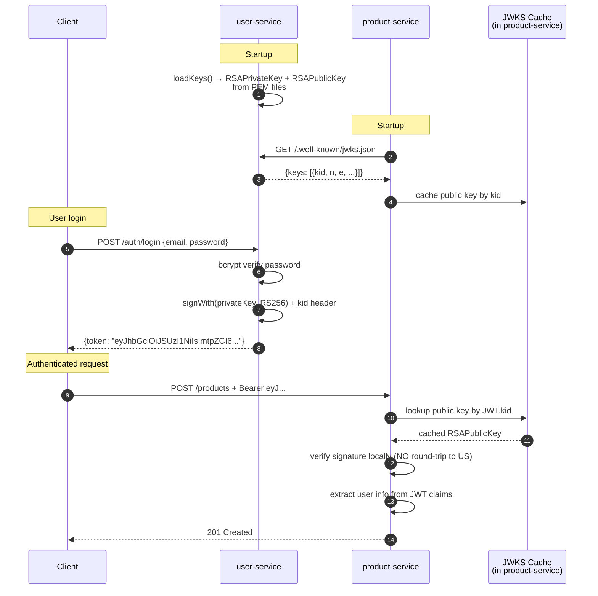
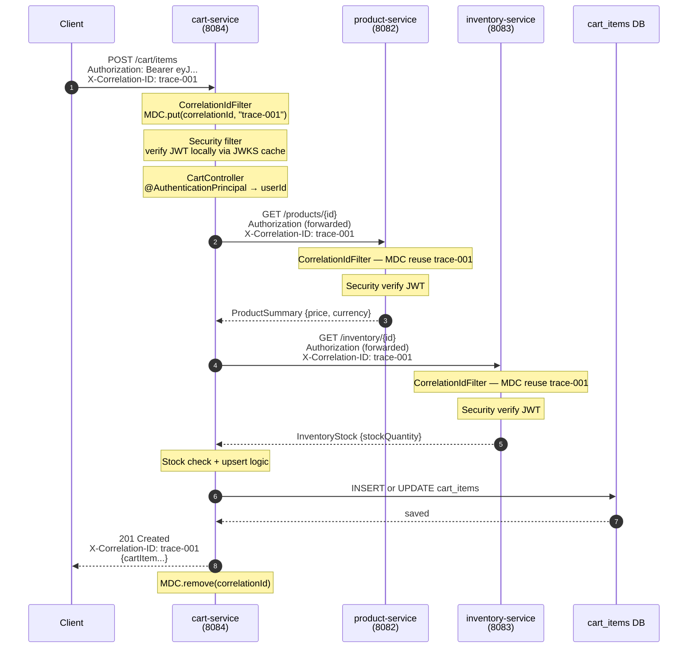
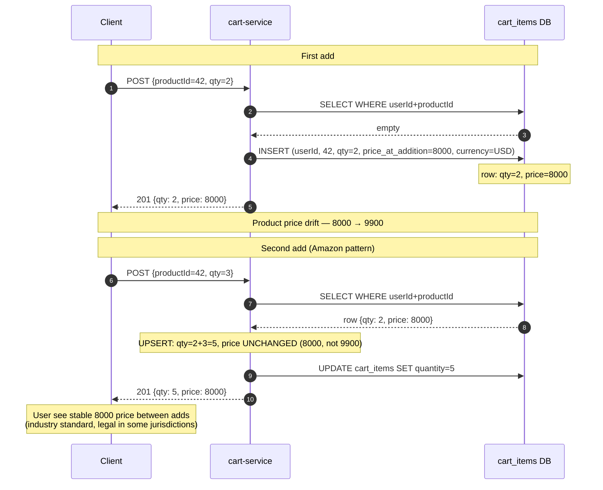

# Lesson 07 — JWT Propagation Across Services

> **Goal**: 將 L4 嘅 HS256 shared-secret JWT 升級成 **RS256 asymmetric crypto + JWKS endpoint**，然後 build 第 4 個 microservice (`cart-service`) demonstrate 一個真實 **end-to-end e-commerce request flow** 跨 4 個 service — client → user-service login → cart → product 驗證 → inventory 檢查 stock — 全程**唔再需要 shared secret，每個 service 可以 local-verify JWT**。最後加 **correlation ID propagation** 為 distributed tracing 鋪底。
>
> **Scope reminder**: 重點係 **service-to-service auth pattern + token propagation + cross-service observability foundation**。Inventory reservation pattern (stock decrement timing) / OAuth 2.0 Token Exchange / OpenTelemetry full trace context — 留低到 L8+。

---

## Learning Objectives

到 L7 完，你應該答得到：

1. 點解 microservices auth **唔可以用 shared secret (HS256)** — 4 個 angle: blast radius / distribution cost / rotation pain / least-privilege violation
2. **RS256 + JWKS pattern** 點 work — private key sign, public key verify, JWKS endpoint serve public key
3. **OAuth 2.0 Resource Server** 喺 Spring 點 wire — `spring-boot-starter-oauth2-resource-server` + `jwk-set-uri`
4. **Custom `JwtAuthenticationConverter`** 點 map JWT `role` claim → Spring `ROLE_*` GrantedAuthority
5. **401 vs 403 distinction** — AuthN fail vs AuthZ fail，frontend redirect logic depends
6. **JWT propagation 3 strategies** trade-off — forward client token / M2M service account / token exchange
7. **Spring Cloud OpenFeign** 嘅 declarative HTTP client + `RequestInterceptor` pattern
8. **Correlation ID propagation** via `OncePerRequestFilter` + MDC + Feign interceptor
9. **Multi-module Maven sibling resolution** trap — `mvn install` from root requirement
10. **The 3-Strategy Inventory Reservation Framework** — Amazon vs Ticketmaster business model trade-off

---

## 1. The Cross-Service Auth Problem

### Setup — 為何 L7 需要存在

L1-L6 留低嘅 codebase state：

```
client → user-service (login)     ← issue JWT
       → product-service           ← wide open (no auth!)
       → inventory-service         ← no HTTP (Kafka consumer only)
```

兩個 gap：
1. **product-service 任何人都可以 POST /products** — 完全 wide open
2. **inventory-service 冇 HTTP endpoint** — 無法做 cross-service query

L7 起 **真正 4-service e-commerce flow**：

```
client login → cart-service → product-service (validate) + inventory-service (check stock)
                  │
                  ├─ POST /cart/items {productId, quantity}
                  └─ persist 落 cart_items
```

每個 hop 都需要 auth — 但 4 個 service **點 share auth state**？呢個就係 L7 嘅核心 question。

### 3-Layer Auth Mental Model

```
┌─────────────────────────────────────────────────────────────────┐
│ Layer 3 — Application                                            │
│   What: 邊個 logical caller? User / Service? 有冇權？             │
│   How: JWT / OAuth / API key                                     │
│   Answer: "user 123 (via cart-service) 想 query inventory"        │
└─────────────────────────────────────────────────────────────────┘
┌─────────────────────────────────────────────────────────────────┐
│ Layer 2 — Transport                                              │
│   What: 個 connection 安全嗎？對方 cert 啱嗎？                    │
│   How: TLS / mTLS                                                │
└─────────────────────────────────────────────────────────────────┘
┌─────────────────────────────────────────────────────────────────┐
│ Layer 1 — Network                                                │
│   What: 邊個 IP 可以 reach 邊個 port?                             │
│   How: VPC / Security Group / NACL                               │
└─────────────────────────────────────────────────────────────────┘
```

L7 主要 attack **Layer 3** — application-layer auth via JWT。

---

## 2. Phase 1 — HS256 → RS256 + JWKS Migration

### Why HS256 fails at microservices scale

L4 嘅 user-service 用 **HS256 (symmetric secret)**：

```yaml
# L4 application.yml
app:
  jwt:
    secret: ${JWT_SECRET:dev-only-secret-...}
```

**4 個致命 weakness：**

| Weakness | 後果 |
|---|---|
| **Catastrophic blast radius** | Secret 一漏 = attacker 可以 forge ANY token — user/service identity 全部失守 |
| **Distribution cost** | 4 service × IAM × Terraform × .env × 3 env (dev/test/prod) — 翻倍嘅 ops surface |
| **Rotation noir** | All-service simultaneous rolling restart + dual-secret verify window — multi-day operation |
| **Least-privilege violation** | `notification-service` 只 verify token 嘅，但 hold 個能 sign token 嘅 secret — 攻擊面放大 5× |

### RS256 + JWKS 嘅解法

**Asymmetric crypto fundamental property：**

```
RSA key pair:
  ┌─────────────────────────┐
  │  Private key            │ ← Only IdP 持有
  │  - 用嚟 sign JWT         │
  └─────────────────────────┘
  ┌─────────────────────────┐
  │  Public key             │ ← 隨便公開，HTTP GET 就攞到
  │  - 用嚟 verify           │
  │  - 唔可以 derive private  │ ← Cryptographic asymmetry
  └─────────────────────────┘
```

JWKS (JSON Web Key Set, RFC 7517) = 公開 endpoint serve public key(s):

```
GET https://user-service/.well-known/jwks.json
→ {"keys": [{kty: "RSA", kid: "...", n: "...", e: "AQAB", ...}]}
```

每個 downstream service 只 store **public key**，洩漏咗都冇所謂 — 唔可以 forge token。

### Implementation

**Step 1 — Generate RSA keys (one-time setup):**

```powershell
# PKCS#8 private key (modern format)
openssl genpkey -algorithm RSA `
  -out services/user-service/src/main/resources/keys/jwt-private.pem `
  -pkeyopt rsa_keygen_bits:2048

# X.509 SubjectPublicKeyInfo public key
openssl rsa `
  -in services/user-service/src/main/resources/keys/jwt-private.pem `
  -pubout `
  -out services/user-service/src/main/resources/keys/jwt-public.pem
```

PEM files **gitignored** (`*.pem` rule in repo root)。Production 用 K8s Secret 或 AWS Secrets Manager mount 落 pod。

**Step 2 — `JwtProperties` 由 secret 轉做 PEM Resources:**

```java
@ConfigurationProperties(prefix = "app.jwt")
public class JwtProperties {
    @NotNull private Resource privateKey;
    @NotNull private Resource publicKey;
    @NotBlank private String keyId;     // ⭐ for JWKS kid
    @Positive private long expirationMinutes;
    @NotBlank private String issuer;
}
```

**Step 3 — `JwtService` HS256 → RS256：**

```java
@Service
public class JwtService {
    private RSAPrivateKey privateKey;
    private RSAPublicKey publicKey;

    @PostConstruct
    public void loadKeys() {
        try (InputStream in = props.getPrivateKey().getInputStream()) {
            this.privateKey = RsaKeyConverters.pkcs8().convert(in);
        }
        try (InputStream in = props.getPublicKey().getInputStream()) {
            this.publicKey = RsaKeyConverters.x509().convert(in);
        }
    }

    public String issueToken(User user) {
        return Jwts.builder()
                .header().keyId(props.getKeyId()).and()       // ⭐ kid header
                .subject(user.getId().toString())
                // ...other claims
                .signWith(privateKey, Jwts.SIG.RS256)          // ⭐ RS256 with private
                .compact();
    }

    public Claims parseClaims(String token) {
        return Jwts.parser()
                .verifyWith(publicKey)                          // ⭐ verify with public
                .requireIssuer(props.getIssuer())
                .build()
                .parseSignedClaims(token)
                .getPayload();
    }
}
```

**Step 4 — Expose JWKS endpoint:**

```java
@RestController
public class JwksController {
    private final JwtService jwtService;

    @GetMapping("/.well-known/jwks.json")
    public Map<String, Object> jwks() {
        RSAKey jwk = new RSAKey.Builder(jwtService.getPublicKey())
                .keyID(jwtService.getKeyId())
                .keyUse(KeyUse.SIGNATURE)
                .algorithm(JWSAlgorithm.RS256)
                .build();
        return new JWKSet(jwk).toJSONObject();
    }
}
```

Nimbus JOSE+JWT 9.40 處理嗮 base64url encoding + BigInteger sign byte trap + JSON serialization。

**Step 5 — `SecurityConfig` permit `/.well-known/jwks.json`:**

```java
.requestMatchers("/.well-known/jwks.json").permitAll()
```

### Verification

```powershell
curl http://localhost:8081/.well-known/jwks.json
```

```json
{
  "keys": [{
    "kty": "RSA",
    "e": "AQAB",
    "use": "sig",
    "kid": "dev-key-2026-05",
    "alg": "RS256",
    "n": "wpKVy_-9XPisEwKisG2gE_lSI3..."
  }]
}
```

Paste public key + JWT into https://jwt.io → **"Signature Verified"** ✅。**呢個就係 RS256 + JWKS 嘅 magic — 任何持有 public key 嘅 service 都可以 verify token，但唔可以 forge。**

---

## 3. Phase 2 — Resource Server Pattern in product/inventory

### `spring-boot-starter-oauth2-resource-server` — production-grade abstraction

3 條落 JWT verification 嘅路：

| Approach | Verdict |
|---|---|
| Hand-roll `OncePerRequestFilter` + manual JWKS fetch + Nimbus parse (~80 lines) | Reinvent wheel ❌ |
| **`spring-boot-starter-oauth2-resource-server`** (2 yml lines + Spring auto-config) | **Production standard** ⭐ |
| Per-request callback to user-service `/auth/validate` | Round-trip cost + IdP SPOF ❌ |

Spring 內部自動：
1. Startup fetch JWKS from configured URL，cache by `kid`
2. 加 `BearerTokenAuthenticationFilter` 喺 filter chain
3. 每 request — extract Bearer，verify signature locally with cached public key
4. Populate `SecurityContext` 成 `JwtAuthenticationToken`
5. Failure → 401

### Wiring

```yaml
# product-service & inventory-service application.yml
spring:
  security:
    oauth2:
      resourceserver:
        jwt:
          jwk-set-uri: ${JWT_JWKS_URI:http://localhost:8081/.well-known/jwks.json}
```

```java
@Configuration
public class SecurityConfig {
    @Bean
    public SecurityFilterChain filterChain(HttpSecurity http) throws Exception {
        return http
                .csrf(AbstractHttpConfigurer::disable)
                .sessionManagement(s -> s.sessionCreationPolicy(SessionCreationPolicy.STATELESS))
                .authorizeHttpRequests(auth -> auth
                        .requestMatchers("/actuator/**", "/error").permitAll()    // ⭐ /error must!
                        .requestMatchers(HttpMethod.GET, "/products", "/products/*").permitAll()
                        .requestMatchers(HttpMethod.POST, "/products").hasRole("SELLER")
                        .requestMatchers(HttpMethod.PUT, "/products/*").hasAnyRole("SELLER", "ADMIN")
                        .requestMatchers(HttpMethod.DELETE, "/products/*").hasRole("ADMIN")
                        .anyRequest().authenticated()
                )
                .oauth2ResourceServer(oauth2 -> oauth2
                        .jwt(jwt -> jwt.jwtAuthenticationConverter(jwtAuthenticationConverter())))
                .build();
    }

    @Bean
    public JwtAuthenticationConverter jwtAuthenticationConverter() {
        var authoritiesConverter = new JwtGrantedAuthoritiesConverter();
        authoritiesConverter.setAuthoritiesClaimName("role");    // ⭐ JWT.role
        authoritiesConverter.setAuthorityPrefix("ROLE_");        // ⭐ Spring magic
        var converter = new JwtAuthenticationConverter();
        converter.setJwtGrantedAuthoritiesConverter(authoritiesConverter);
        return converter;
    }
}
```

### 4 個 critical traps

1. **`/error` permit** — Spring Boot 對 404 / unknown route forward 去 `/error`，Security filter chain re-evaluate → fall through 到 `.anyRequest().authenticated()` → spurious **401 instead of true 404/405**。Standard Spring Boot boilerplate fix。

2. **`hasRole()` magic `ROLE_` prefix** — Spring's `hasRole("SELLER")` 內部 check `"ROLE_SELLER"` authority。`JwtGrantedAuthoritiesConverter.setAuthorityPrefix("ROLE_")` mandatory else AuthZ permanently fail。

3. **requestMatchers 順序** — Spring 由上至下 match，first-match-wins。所以 specific → general 順序：

```java
.requestMatchers("/actuator/**", "/error").permitAll()              // most specific first
.requestMatchers(HttpMethod.GET, "/products", "/products/*").permitAll()
.requestMatchers(HttpMethod.POST, "/products").hasRole("SELLER")
.anyRequest().authenticated()                                        // catch-all last
```

4. **401 vs 403 distinction：**
   - **401 Unauthorized**: 「你係邊個都唔知」 — JWT missing / invalid / expired (AuthN fail) → frontend redirect login
   - **403 Forbidden**: 「我知你係邊個，但你冇權」 — JWT valid 但 role 唔夠 (AuthZ fail) → frontend show "permission denied"
   - Mix 兩個 status code → frontend redirect logic 錯亂

### E2E verification (4 scenarios)

| Scenario | Expected |
|---|---|
| POST /products **no token** | 401 |
| POST /products with USER role JWT | 403 |
| POST /products with SELLER role JWT | 201 |
| GET /products/{id} no token (public catalog) | 200 |

---

## 4. Phase 3 — cart-service: 4th Microservice + Feign + JWT Propagation

### Module scaffold

```
services/cart-service/
├── pom.xml                                  # Spring Cloud 2025.0.0 + OpenFeign
├── docker-compose.yml                       # MySQL 3310, Adminer 8093
└── src/main/
    ├── java/com/onlineshopping/cart/
    │   ├── CartServiceApplication.java      # @EnableFeignClients + scanBasePackages
    │   ├── entity/                          # CartItem + CartItemId (composite PK)
    │   ├── repository/                       # CartItemRepository
    │   ├── dto/                              # AddCartItemRequest, CartItemResponse
    │   ├── client/                           # ProductClient + InventoryClient (Feign) + interceptors
    │   ├── service/                          # CartService (orchestration)
    │   ├── controller/                       # CartController POST /cart/items
    │   └── security/                         # SecurityConfig (mirror Phase 2)
    └── resources/
        ├── application.yml                   # port 8084
        └── db/migration/V1__init_cart_schema.sql
```

Port allocation: user 8081, product 8082, inventory 8083, **cart 8084**。

### Schema design — DynamoDB-friendly composite PK

```sql
CREATE TABLE cart_items (
    user_id            BIGINT       NOT NULL,
    product_id         BIGINT       NOT NULL,
    quantity           INT          NOT NULL,
    price_at_addition  BIGINT       NOT NULL,      -- cents snapshot
    currency           CHAR(3)      NOT NULL,      -- ISO 4217 snapshot
    created_at         TIMESTAMP(6) NOT NULL DEFAULT CURRENT_TIMESTAMP(6),
    updated_at         TIMESTAMP(6) NOT NULL DEFAULT CURRENT_TIMESTAMP(6) ON UPDATE CURRENT_TIMESTAMP(6),
    version            BIGINT       NOT NULL DEFAULT 0,

    PRIMARY KEY (user_id, product_id),             -- ⭐ DynamoDB: PK=user_id, SK=product_id
    CONSTRAINT chk_quantity_positive CHECK (quantity > 0)
);
```

Design decisions:
- **Composite PK `(user_id, product_id)`** — DynamoDB-friendly (future migration: PK=user_id, SK=product_id)
- **No Snowflake ID** — composite PK 已 unique，唔需要 separate aggregate ID
- **`price_at_addition` snapshot** — Amazon pattern：user 加入 cart 嗰個價，product price drift 唔影響 cart
- **Upsert pattern**: same product 加多次 → quantity 累加，price snapshot 保留 first-add 嗰個

### JPA Composite PK via `@IdClass`

```java
// CartItemId.java
@Getter @Setter @NoArgsConstructor @AllArgsConstructor @EqualsAndHashCode
public class CartItemId implements Serializable {
    private Long userId;
    private Long productId;
}

// CartItem.java
@Entity
@Table(name = "cart_items")
@IdClass(CartItemId.class)
public class CartItem {
    @Id @Column(name = "user_id") private Long userId;
    @Id @Column(name = "product_id") private Long productId;
    private Integer quantity;
    private Long priceAtAddition;
    // ...
}
```

`@IdClass` vs `@EmbeddedId`: 兩個都 work，`@IdClass` 嘅 entity API 更乾淨 (`cartItem.getUserId()` 直接 access)。

### JWT Propagation — 3 strategy 揀 Option 1

| Option | Description | Verdict |
|---|---|---|
| **1. Forward client token** ⭐ | cart 直接 forward incoming Bearer header to downstream | Industry default |
| 2. M2M service account token | cart 用 service account 換 token | Loses user identity |
| 3. Token Exchange (RFC 8693) | cart 換 "我代表 user X" delegated token | Most "correct"，+1 round-trip |

**Option 1 wins because：**
1. **User identity preservation** — downstream AuthZ 需要 user context (e.g. "user X region EU，呢 SKU 限定 US")
2. **Simplicity** — 一行 Feign interceptor 搞掂
3. **TTL 統一** — user token expire = 全部 downstream sync expire，predictable
4. **Caller identity goes elsewhere** — mTLS / service mesh / SPIFFE 喺 transport layer 處理，唔污染 JWT

### `FeignAuthForwardInterceptor`

```java
@Component
public class FeignAuthForwardInterceptor implements RequestInterceptor {

    @Override
    public void apply(RequestTemplate template) {
        ServletRequestAttributes attrs =
                (ServletRequestAttributes) RequestContextHolder.getRequestAttributes();
        if (attrs == null) return;   // background thread — no request context

        String authHeader = attrs.getRequest().getHeader(HttpHeaders.AUTHORIZATION);
        if (authHeader != null && !authHeader.isBlank()) {
            template.header(HttpHeaders.AUTHORIZATION, authHeader);
        }
    }
}
```

`RequestContextHolder` — Spring servlet 嘅 ThreadLocal access to current HTTP request。Sync servlet model only。`@Component` 自動 register 同所有 Feign clients。

### `CartService.addItem` — 5-step orchestration

```java
@Transactional
public CartItemResponse addItem(Long userId, AddCartItemRequest req) {
    // 1. Validate product exists + get price snapshot
    ProductSummary product;
    try {
        product = productClient.findById(req.productId());
    } catch (FeignException.NotFound e) {
        throw new ResponseStatusException(HttpStatus.NOT_FOUND, "Product not found");
    }

    // 2. Check stock availability
    InventoryStock stock;
    try {
        stock = inventoryClient.getStock(req.productId());
    } catch (FeignException.NotFound e) {
        throw new ResponseStatusException(HttpStatus.NOT_FOUND, "Inventory missing");
    }

    int existingQty = cartItemRepo.findById(new CartItemId(userId, req.productId()))
            .map(CartItem::getQuantity).orElse(0);
    int totalRequested = existingQty + req.quantity();
    if (totalRequested > stock.stockQuantity()) {
        throw new ResponseStatusException(HttpStatus.CONFLICT, "Insufficient stock");
    }

    // 3. Upsert — first add snapshots price, subsequent only bumps qty
    Optional<CartItem> existing = cartItemRepo.findById(new CartItemId(userId, req.productId()));
    CartItem saved;
    if (existing.isPresent()) {
        CartItem item = existing.get();
        item.setQuantity(item.getQuantity() + req.quantity());     // ⭐ price unchanged
        saved = cartItemRepo.save(item);
    } else {
        CartItem item = CartItem.builder()
                .userId(userId).productId(req.productId())
                .quantity(req.quantity())
                .priceAtAddition(product.priceCents())             // ⭐ snapshot
                .currency(product.currency())                       // ⭐ snapshot
                .build();
        saved = cartItemRepo.save(item);
    }

    return CartItemResponse.from(saved);
}
```

### Controller — `@AuthenticationPrincipal` extracts userId from JWT

```java
@PostMapping("/items")
public ResponseEntity<CartItemResponse> addItem(
        @AuthenticationPrincipal Jwt jwt,                  // ⭐ Spring DI from SecurityContext
        @Valid @RequestBody AddCartItemRequest req) {
    Long userId = Long.valueOf(jwt.getSubject());          // sub claim = user id
    return ResponseEntity.status(HttpStatus.CREATED).body(cartService.addItem(userId, req));
}
```

**Cleaner than `SecurityContextHolder.getContext()...`** — DI-friendly, naturally testable。

### E2E test (4-service chain)

```powershell
curl -X POST http://localhost:8084/cart/items `
  -H "Authorization: Bearer $SELLER_TOKEN" `
  -H "Content-Type: application/json" `
  -d '{"productId":316300956490928128,"quantity":2}'
```

Flow:
1. cart-service Security filter verify JWT (local with cached public key) ✅
2. `@AuthenticationPrincipal Jwt` extract userId from sub claim
3. cart → `FeignAuthForwardInterceptor` attach Authorization header → product-service GET /products/{id}
4. product-service Security filter verify same JWT → return ProductSummary
5. cart → InventoryClient (same auth-forward) → inventory-service GET /inventory/{id}
6. inventory-service verify → return stock count
7. Stock check + upsert → persist cart_items row
8. Return 201 + CartItemResponse

---

## 5. Phase 4 — Correlation ID Propagation (Distributed Tracing 1st Gen)

### Why correlation ID

L4-L7 已 build 4-service chain。Production debugging reality：

```
Customer complaint at 11:42 "我加 product 入 cart 失敗"
    ↓
Oncall engineer: 邊條 log line 屬於佢個 request?
    ↓
4 個 service × 100 req/s = thousands of log lines per minute
    ↓
冇 correlation ID → impossible to reconstruct request flow
```

**Solution: 每個 request 攜帶 unique ID 跨 4 service log lines。** Grep 一條 ID 即 reconstruct cross-service event chain。

### Header convention

```
X-Correlation-ID: my-trace-001       ← most common
X-Request-ID:                          ← Stripe, Heroku
traceparent:                           ← W3C Trace Context (OpenTelemetry standard)
```

L7 用 `X-Correlation-ID` (simplest)。Future lesson 升 W3C Trace Context + OpenTelemetry。

### Shared module — `shared/common-web`

3rd shared module (after `common-events` + `common-dto`)：

```
shared/common-web/
├── pom.xml                                   # spring-web + jakarta.servlet-api (provided)
└── src/main/java/com/onlineshopping/common/web/
    └── CorrelationIdFilter.java
```

```java
@Component
@Order(Ordered.HIGHEST_PRECEDENCE)               // ⭐ run before all logging filters
public class CorrelationIdFilter extends OncePerRequestFilter {

    public static final String HEADER = "X-Correlation-ID";
    public static final String MDC_KEY = "correlationId";

    @Override
    protected void doFilterInternal(HttpServletRequest req, HttpServletResponse resp,
                                     FilterChain chain) throws ServletException, IOException {
        String correlationId = req.getHeader(HEADER);
        if (correlationId == null || correlationId.isBlank()) {
            correlationId = UUID.randomUUID().toString();
        }
        try {
            MDC.put(MDC_KEY, correlationId);
            resp.setHeader(HEADER, correlationId);
            chain.doFilter(req, resp);
        } finally {
            MDC.remove(MDC_KEY);                  // ⭐ ThreadLocal cleanup for pool reuse
        }
    }
}
```

**Critical details:**
1. **`@Order(Ordered.HIGHEST_PRECEDENCE)`** — run before Spring Security / DispatcherServlet so all downstream log lines benefit from MDC
2. **`MDC.remove` in `finally`** — Tomcat reuses worker threads; stale MDC leaks previous request's ID to next request (classic Java ThreadLocal pitfall)

### Each service consumes shared module

```xml
<!-- 4 service poms -->
<dependency>
    <groupId>com.onlineshopping</groupId>
    <artifactId>common-web</artifactId>
</dependency>
```

```java
// 4 Application classes
@SpringBootApplication(scanBasePackages = {
        "com.onlineshopping.<service>",
        "com.onlineshopping.common.web"             // ⭐ shared package scan
})
```

```yaml
# 4 application.yml
logging:
  pattern:
    console: "%clr(%d{HH:mm:ss.SSS}){faint} %clr([%X{correlationId:-no-cid}]){magenta} %clr(%-5level) %clr(%logger{36}){cyan} - %msg%n"
spring:
  output:
    ansi:
      enabled: always
```

### cart-service Feign propagation

```java
@Component
public class FeignCorrelationIdInterceptor implements RequestInterceptor {
    @Override
    public void apply(RequestTemplate template) {
        String correlationId = MDC.get(CorrelationIdFilter.MDC_KEY);
        if (correlationId != null) {
            template.header(CorrelationIdFilter.HEADER, correlationId);
        }
    }
}
```

Feign call runs on **same servlet thread** as inbound request → MDC ThreadLocal intact → interceptor reads correlation ID and forwards via header → downstream `CorrelationIdFilter` picks up same ID from header instead of generating new。

### E2E demo

```powershell
curl -i -X POST http://localhost:8084/cart/items `
  -H "Authorization: Bearer $TOKEN" `
  -H "X-Correlation-ID: l7-phase4-test-001" `
  -d '{"productId":..., "quantity":1}'
```

```
[cart-service]      11:55:44.909 [l7-phase4-test-001] INFO  FeignAuth - Attached Authorization header
[cart-service]      11:55:44.910 [l7-phase4-test-001] INFO  FeignCorr - Attached X-Correlation-ID header
[product-service]   11:55:45.123 [l7-phase4-test-001] INFO  ProductController - GET /products/316300956490928128
[inventory-service] 11:55:45.456 [l7-phase4-test-001] INFO  InventoryController - GET /inventory/316300956490928128
[cart-service]      11:55:47.822 [l7-phase4-test-001] INFO  CartService - Cart upsert: userId=3 productId=... qty 5->6
```

**Single grep `l7-phase4-test-001` reconstructs嗮 cross-service request flow** 🪡

### Why this is foundation of distributed tracing

```
L7 correlation ID = 1st gen distributed tracing
   - String-based, manual propagation
   - 95% of incident debug capacity

OpenTelemetry / Jaeger = 2nd gen
   - W3C Trace Context (traceparent header)
   - Span IDs hierarchical (parent→child relationships)
   - Sampling, baggage, exemplars
   - 5% remaining cases (perf root cause, error propagation graph)
```

Modern production runs BOTH — application emits correlation ID for human grep, OpenTelemetry agents emit spans for machine analysis。L7 教 1st gen，L11+ 升 2nd gen。

---

## 6. The 3-Strategy Inventory Reservation Framework

Architectural depth — 小V raised: "加入 cart 之後 inventory 要唔要扣 stock?" 

### Strategy 1: Optimistic — No reservation, check at checkout ⭐ L7 choice

```
Add to cart  → record qty only (inventory untouched)
Checkout     → re-check stock + decrement at order placement
```

- ✅ Simple, no reservation table, no TTL cleanup
- ⚠️ Overselling possible on race conditions
- **Used by: Amazon (non-scarce), Shopify default**

### Strategy 2: Soft reservation — Decrement on add, release on TTL

```
Add to cart  → decrement inventory + reservation row {user, product, qty, expires_at}
Checkout    → convert reservation → permanent order
Abandoned   → TTL expire → background job restore
```

- ✅ No overselling
- ⚠️ Reservation table + TTL cleanup job + complexity
- **Used by: Ticketmaster, hotel booking, airline seats, Stripe Checkout (15-min PaymentIntent)**

### Strategy 3: Hard reservation — Decrement on add, manual release

- ⚠️ Abandoned cart = 死數 forever → bad UX
- **Used by: rare legacy systems**

### When to pick which

| Item type | Strategy | Why |
|---|---|---|
| Books, electronics, clothes | **1** | Replenishable, overselling acceptable |
| Concert tickets, hotel rooms | **2** | Irreplaceable, overselling = lawsuit |
| Limited-edition drops | **2** with very short TTL | Anti-bot + scarcity |
| Build-to-order | **1** | Stock concept N/A |

L7 picked **Strategy 1** because focus = JWT propagation。Strategy 2 evolution → L8/L9 saga pattern。

---

## 7. Sequence Diagrams

### 7.1 RS256 sign + verify flow



### 7.2 4-service cart flow with JWT + correlation ID



### 7.3 Upsert pattern — same product added twice



---

## 8. Testing Strategy

### Test pyramid for L7

| Layer | What we test | Files |
|---|---|---|
| Unit (cart) | CartService 5 branches (happy / upsert / 409 / 404 product / 404 inventory) | `CartServiceTest.java` |
| Unit (inventory) | InventoryService getStock (existing) + L7 initialStock propagation | `InventoryServiceTest.java` (existing, expanded) |
| Integration | Resource server JWT verification with real JWKS | Deferred (homework Q2) |
| Manual e2e | 4-service curl chain + jwt.io signature verification | Phase 3 + 4 demo |

### `CartServiceTest` (5 paths)

| Test | Assertion |
|---|---|
| `happyPath_insertsNewItem_snapshotsPriceAndCurrency` | New row + price snapshot from product-service |
| `upsert_incrementsQuantity_keepsOriginalPrice` | Same row updated, **priceAtAddition unchanged** |
| `insufficientStock_throws409` | `(existing + req) > stock` → 409, save NEVER called |
| `productNotFound_throws404` | FeignException.NotFound → 404, inventoryClient NEVER called (short-circuit) |
| `inventoryNotFound_throws404` | productClient OK, inventoryClient throws → 404, save NEVER called |

### Mocking FeignException.NotFound

```java
private static FeignException.NotFound notFound(String url) {
    Request req = Request.create(Request.HttpMethod.GET, url, Map.of(), null, new RequestTemplate());
    return new FeignException.NotFound("not found", req, null, null);
}
```

Lightest valid envelope for Feign exception construction in unit tests。

### Assertion style — type-safe HttpStatus

```java
// ❌ Brittle (depends on Spring's message format)
.hasMessageContaining("409")

// ✅ Type-safe
.satisfies(e -> assertThat(((ResponseStatusException) e).getStatusCode())
        .isEqualTo(HttpStatus.CONFLICT))
```

---

## 9. War Stories

### 1. `jakarta.annotation.Resource` vs `org.springframework.core.io.Resource` import trap (caught 3 times)

Same type name, different package:
- `jakarta.annotation.Resource` = CDI dependency injection marker
- `org.springframework.core.io.Resource` = Spring file abstraction (what we want)

IDE auto-import 容易揀錯第一個。Caught in:
- `JwtProperties` (Phase 1)
- `CategoryController` + `CategoryService` (cleanup)
- `ProductController` (Phase 4 cleanup)

**Take-away**: 改完 file Ctrl+Alt+O optimize imports + scan import statements for cross-package collisions。

### 2. Spring Boot `/error` MUST be permitAll

```
Unknown route → DispatcherServlet 404 → forward `/error` → Security re-eval → spurious 401
```

Standard boilerplate: `.requestMatchers("/actuator/**", "/error").permitAll()`。

### 3. Lombok `@Builder` ignores field initializers — need `@Builder.Default`

```java
@Builder
class Product {
    private String currency = "CAD";        // ❌ ignored by builder
}

Product p = Product.builder().build();
// p.currency == null (NOT "CAD")
```

Fix: `@Builder.Default` annotation. 5 entity fields fixed in L5 code during L7 phase 2 cleanup.

### 4. 401 vs 403 distinction

| Status | Meaning | Frontend response |
|---|---|---|
| 401 | AuthN fail (JWT missing/invalid) | Redirect login |
| 403 | AuthZ fail (role insufficient) | Show "permission denied" |

Mix them → frontend logic 錯亂。

### 5. `oauth2-resource-server` starter > hand-rolling filter

3 條落 JWT verification 嘅路只有 starter 係 production answer。Hand-roll = reinvent wheel anti-pattern。

### 6. Spring Security `hasRole()` magic `ROLE_` prefix

```java
hasRole("SELLER")      → 內部 check "ROLE_SELLER" authority
hasAuthority("SELLER") → check literal "SELLER"
```

`JwtGrantedAuthoritiesConverter.setAuthorityPrefix("ROLE_")` 必須加 — else AuthZ 永遠 false。

### 7. Layered architecture consistency

Controller → Service → Repository。Skip middle layer = inconsistent codebase。`InventoryController` 第一版本 inject `InventoryRepository` direct，小V catch — refactor to `InventoryService.getStock()`。

### 8. Multi-module Maven sibling resolution

```
cd services/user-service && mvn compile
   ↓
ERROR: Could not find artifact com.onlineshopping:common-web
```

Service-level `mvn` 唔識 sibling module。Fix：
- `mvn install -DskipTests` from root (install jar to `~/.m2/`)
- OR `mvn -pl services/<svc> -am` (also-make dependencies)

Re-learn L2 multi-module lesson — adding new module always requires reactor-level install。

### 9. `<scope>provided</scope>` non-transitive

```
spring-web 
   └── jakarta.servlet-api  ← <scope>provided</scope> NOT transitive
```

`common-web` depend on `spring-web` 唔等於 inherit servlet-api。Must explicitly declare:

```xml
<dependency>
    <groupId>jakarta.servlet</groupId>
    <artifactId>jakarta.servlet-api</artifactId>
    <scope>provided</scope>
</dependency>
```

### 10. "Filter wired ≠ log line visible"

Phase 4 demo gap：CorrelationIdFilter 正確 set MDC + response header (verified via curl -i `X-Correlation-ID` in response)，但 product-service / inventory-service log line 度搵唔到 trace ID。

Root cause: **controller endpoints had NO `log.info()` statements** — filter mechanism work but nothing to demonstrate it。

Discipline: **每個 controller entry point 至少 1 條 INFO log line** — distributed traces visible without DEBUG level needed。

### 11. Cart upsert with stable price snapshot (Amazon pattern)

不算 bug 但係 important architectural decision。Same product 加多次：
- ✅ quantity increment (3 → 5 → 6)
- ✅ `priceAtAddition` + `currency` **unchanged** from first add

業界 standard (Amazon / Shopify / Stripe Checkout) — 保護 user 喺 add-to-cart 同 checkout 之間嘅 price drift。Some jurisdictions 法律要求 honor displayed price。

---

## 10. Production Gaps Documented

| Gap | 將來邊一課 | Why deferred |
|---|---|---|
| 1. Key rotation automation | L13 ops | Need K8s Secret rotation tool + JWKS multi-key serving |
| 2. JWT refresh token + revocation | L8 homework | Need redis blocklist + refresh endpoint |
| 3. Service mesh (Istio) mTLS at transport | L20+ | Replace FeignAuthForwardInterceptor at infra layer |
| 4. OAuth 2.0 Token Exchange (RFC 8693) | L18 enterprise | Full delegated identity audit chain |
| 5. Inventory reservation pattern | L9 saga | Strategy 2 — reservation table + TTL cleanup + saga orchestrator |
| 6. W3C Trace Context migration | L11 observability | OpenTelemetry traceparent header + Jaeger spans |
| 7. Per-Feign-client retry + timeout | L10 resilience | Resilience4j circuit breaker integration |
| 8. Cart batch endpoints (`GET /cart`, `DELETE /cart/items/{id}`) | L8 feature | Currently only POST — incomplete CRUD |
| 9. Cart → DynamoDB migration | L15+ | Per L3 design decision — re-architect storage layer |
| 10. Inventory stock decrement on order placement | L9 saga | Connects to OrderService not yet existing |

---

## 11. Interview Prep Q&A

### Q1 — 點解 microservices auth 唔用 shared secret?

4 個 angle:
1. **Blast radius** — secret 一漏 = forge any token，全 service 淪陷
2. **Distribution cost** — 4 service × IAM × env × Terraform = ops overhead
3. **Rotation pain** — multi-service rolling restart + dual-secret window
4. **Least-privilege violation** — verify-only service hold sign-capable secret

RS256 + JWKS 解決嗮：私鑰只喺 IdP，公鑰任意分發。

### Q2 — JWKS endpoint 嘅 4 個 design considerations

1. **Caching** — Spring oauth2-resource-server 預設 cache，TTL via `Cache-Control` header
2. **Key rotation** — JWKS array 同時 serve 多個 key (new + old until TTL expires)
3. **HTTPS mandatory** — public key over HTTP = MITM swap risk
4. **Discoverability** — `.well-known` URI prefix per RFC 5785

### Q3 — JWT propagation 3 strategies trade-off

| Strategy | Use case | Trade-off |
|---|---|---|
| Forward token (Option 1) | User-context flows | Simplest, preserves identity, used by most B2C |
| M2M service token (Option 2) | Async / batch / system-to-system | Loses user identity, +token issuance complexity |
| Token Exchange RFC 8693 | Enterprise zero-trust | Full audit chain, +1 round-trip per request |

### Q4 — `RequestContextHolder` vs reactive context

Spring servlet's `RequestContextHolder` = ThreadLocal-backed → only works in synchronous servlet model。WebFlux uses Reactor Context — entirely different mechanism。`FeignAuthForwardInterceptor` 而家嘅 implementation **不適用 WebFlux migration**。

### Q5 — Cart inventory reservation 點 design

依靠 item characteristics:
- **Replenishable (books, electronics)** → Optimistic (no reservation), check at checkout — Amazon model
- **Irreplaceable (tickets, hotel rooms)** → Soft reservation with TTL — Ticketmaster model

Cart-service 而家係 Strategy 1。L9 saga lesson 加 Strategy 2。

### Q6 — Correlation ID vs distributed tracing

- **Correlation ID**: string-based, manual propagation via header + MDC + Feign interceptor. Grep-based debugging. Covers 95% of incident root cause.
- **W3C Trace Context (OpenTelemetry)**: span IDs hierarchical (parent→child), sampling, baggage, exemplars. Machine analysis. Covers remaining 5% (perf root cause, error propagation graph).

Production 通常 run both。L7 demonstrate 1st gen，L11+ 升 2nd gen。

### Q7 — 點 graceful rotate JWT signing key 唔 break existing sessions

1. Generate new key pair (kid=v2)
2. JWKS serve **both** old + new public keys
3. Sign new tokens with new private key
4. Old tokens still verify (old public key in JWKS)
5. Wait full token TTL (e.g. 1 hour)
6. Remove old key from JWKS

Zero downtime + zero forced re-login。

### Resume bullets

- Migrated user-service JWT from HS256 shared secret to **RS256 + JWKS endpoint** (RFC 7517), eliminating cross-service secret distribution
- Implemented **4-service e-commerce flow** with Spring Cloud OpenFeign declarative HTTP clients + JWT propagation via RequestInterceptor
- Built **distributed tracing foundation** via correlation ID propagation across all services using `OncePerRequestFilter` + MDC + Feign interceptor pattern
- Designed **DynamoDB-friendly cart schema** with composite PK `(user_id, product_id)` and `@IdClass` JPA mapping, ready for storage layer migration
- Applied **Amazon's price snapshot pattern** in cart upsert logic — `priceAtAddition` captured at first add, protected from product price drift

---

## 12. Homework / Reflection

完 lesson 之前自問（解答喺 L8 開始時 fold 入 collapsible block）：

1. **JWT refresh token mechanism** — 當前 token TTL = 60 min，過期就要 user re-login。設計一個 refresh token flow：(a) `/auth/refresh` endpoint accept refresh token, return new access token + new refresh token (refresh rotation); (b) refresh token storage (cookie httpOnly vs localStorage trade-off); (c) revocation strategy (Redis blocklist with TTL = refresh-token TTL); (d) logout endpoint 點 invalidate active refresh token。

2. **`@EmbeddedKafka` / `@SpringBootTest` integration test for 4-service chain** — 寫一個 integration test: spin user-service + product-service + inventory-service + cart-service via Testcontainers，full request POST /cart/items, assert e2e flow完成。提示：`@ServiceConnection` for MySQL containers + WireMock for inter-service stubbing。

3. **Service mesh replacement scenario** — 如果引入 Istio (mTLS automatic + SPIFFE identity)，`FeignAuthForwardInterceptor` 點 retire? mTLS 同 application-layer JWT 嘅 responsibility split — 寫個 design doc 解釋:
   (a) 仲需要 application JWT 嗎？
   (b) `JwtAuthenticationConverter` 點重用 mTLS peer cert info？
   (c) 邊個 component own request authentication — sidecar vs Spring Security filter chain？

4. **Inventory reservation pattern落地 (Strategy 2)** — 加 `inventory_reservations` 表 (PK reservation_id, user_id, product_id, qty, expires_at)。Cart POST 嗰陣 decrement `inventories.stockQuantity` + create reservation。Add background TTL cleanup job (15-min default expiry) — 寫 pseudo-code + race-condition analysis (兩個 user 同時加最後一件 stock 嘅 outcome)。

5. **OpenTelemetry migration plan** — 由 `X-Correlation-ID` header migrate 去 W3C Trace Context (`traceparent` header)。寫 step-by-step migration:
   (a) 加 `opentelemetry-spring-boot-starter` dep
   (b) Auto-instrumentation vs manual span 點選擇
   (c) Backward compat — dual-emit both headers during transition
   (d) Sampling strategy (1% production traffic vs full dev)

---

## 13. Next Lesson Preview — Lesson 08

**L8 — Resilience4j Circuit Breaker + Retry across cart-service Feign calls**

- 加 `resilience4j-spring-boot3` to cart-service
- `@CircuitBreaker` + `@Retry` on ProductClient + InventoryClient calls
- Failure scenarios: product-service down / slow / 503 / network timeout
- Fallback method patterns (cached price snapshot? cart degraded mode?)
- Metrics via Micrometer (failure rate, latency p99, circuit state)
- Future hooks: connect to Strategy 2 inventory reservation (L9) + observability (L11)

**Reinforce points** L7 留低嘅:
- Q1 (JWT refresh) 將會喺 L8 first lesson hand-on
- Q4 (inventory reservation) 進入 L9 saga pattern foundation

---

## References

- RFC 7517 — JSON Web Key (JWK): https://datatracker.ietf.org/doc/html/rfc7517
- RFC 7519 — JSON Web Token (JWT): https://datatracker.ietf.org/doc/html/rfc7519
- RFC 8693 — OAuth 2.0 Token Exchange: https://datatracker.ietf.org/doc/html/rfc8693
- RFC 5785 — `/.well-known/` URIs: https://datatracker.ietf.org/doc/html/rfc5785
- Spring Security OAuth2 Resource Server: https://docs.spring.io/spring-security/reference/servlet/oauth2/resource-server/jwt.html
- Spring Cloud OpenFeign: https://spring.io/projects/spring-cloud-openfeign
- Nimbus JOSE+JWT: https://connect2id.com/products/nimbus-jose-jwt
- W3C Trace Context: https://www.w3.org/TR/trace-context/
- BeyondCorp (Google zero-trust): https://research.google/pubs/beyondcorp-a-new-approach-to-enterprise-security/
- NIST SP 800-207 Zero Trust Architecture: https://nvlpubs.nist.gov/nistpubs/SpecialPublications/NIST.SP.800-207.pdf
